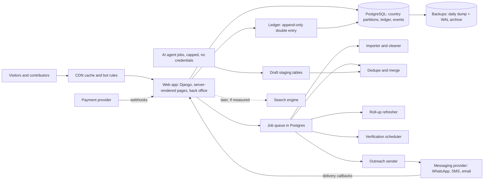

# AllLists.org: technical analysis

Prepared 2026-10-05 for the founder. Plain English; each technical term is defined where first used. Nothing in `docs/DECISIONS.md` is reopened. Where I propose something for an open item (for example the stack, Q-S9), it is labelled a proposal.

Evidence tags used throughout: **[M]** measured by me this session by running something; **[S]** sourced from a repository file or a web search result (not opened at the primary page unless stated); **[I]** my inference or estimate; **[U]** unverified recall. Section 14 explains how much weight each deserves.

---

## 1. Verdict

**Is it technically feasible at the stated scale? Yes, if "scale" means what the data actually is, and no if it means "a published page for every list type at every place".**

| Question | Answer |
|---|---|
| Can one database hold the entries? | Yes. A realistic entry with per-field provenance, contacts, services and change history cost **about 1.7 KB** in my test [M]. 10 million entries is about 17 GB; 100 million about 175 GB [M, extrapolated]. That is one ordinary managed Postgres server for years, partitioned by country. |
| Can it serve the traffic? | Yes. At 10 million page views a month with a CDN (a network of caches near readers), the database sees about 19 queries a second at the busiest moment [I, arithmetic]. The measured list-page query took 2 to 50 ms at 1 million entries [M]. |
| Are billions of lists possible? | As **virtual** list-places, yes: they are a category crossed with a place and need no rows until they hold entries. Roughly 1 to 11 billion combinations exist [I]. As **published pages**, no. In my test only **0.04% to 0.1%** of possible list-places had 10 or more entries [M, synthetic]. Pages must be created only when they deserve to exist. |

**The three hardest problems** (none is "more servers"):
1. **Trust at scale across scripts.** Duplicate detection, verification honesty and freshness, across Urdu, Arabic and Latin spellings. This is data work, and it decides whether anyone pays.
2. **Showing enough to rank, hiding enough to sell.** Public indexable pages versus paid data, anti-copying, and publishing only worthy pages.
3. **Money and messaging correctness.** An exact ledger with rates locked per entry, and outreach that is lawful, opted-in and cannot get the sending number banned.

**What is solid:** the data model in `docs/LIST_AND_ENTRY_COMPONENTS.md` (fixed core, child records, add-on registry, per-value metadata) maps cleanly to Postgres [M, I built it]. The decision to use one database, one application and one managed host first is right. Measured read and write loads are tiny relative to what one server handles.

**What is not solid:**
- The code in `backend/` is a different, much smaller product (flat lists with a price). It has no places, no entries, no provenance, no ledger. Treat it as scaffolding to replace, not a base to extend.
- Secrets exposed in git history are, as far as I can tell, not rotated.
- Urdu search is untested beyond my small checks; a clean cross-script match does not exist in Postgres out of the box [M].
- Outreach economics and legality, AI draft accuracy, and search-engine indexing are unproven, and none is a coding problem.

**Confidence:** high that storage, read load and the page query are feasible (measured, though on synthetic data). Medium on duplicate detection and multilingual search (approach is standard; tuning on real Urdu data is unknown). Low on outreach, AI accuracy and organic traffic. Build cost is an estimate (20 to 40 person-months, section 8).

---

## 2. What exists today

### 2.1 What I ran

| Command (from `/home/user/Alllists.org`) | Result [M] |
|---|---|
| `pytest` (Python 3.11.15) | **22 passed** in 5.4 s |
| `flake8 . --select=E9,F63,F7,F82` (the CI's blocking check) | 0 problems |
| `flake8 . --max-line-length=127 --max-complexity=10` | 1 style warning (`backend/tests/conftest.py:14`, 152 characters) |
| `coverage run -m pytest` on `backend/app` | **95% of 299 statements**; uncovered: 14 lines, mostly error branches |
| `bandit -r backend/app` (security linter) | No findings |
| `pip-audit -r backend/requirements.txt` | "No known vulnerabilities found" |
| Timing of `POST /api/lists/recommend` over 2,000 lists | 169 ms per call, **unauthenticated** |
| 20 wrong-password logins in a row | All answered; **no lockout or rate limit**; 111 ms each |
| `git log --all` search of removed files | Credentials remain in history (see 2.4) |
| GitHub Actions run list (66 runs) | Runs 116 to 119 **failed**; runs 120 to 123 **succeeded** (Python 3.9, 3.10, 3.11) [S, GitHub] |

### 2.2 What the 22 tests cover and do not

| Covered (backend code that exists) | Not covered |
|---|---|
| Health and 404 JSON; production refuses to start without secrets | Anything about places, entries, taxonomy, provenance, verification, ledger, outreach (none exist) |
| Register, login by name or email, validation, duplicates, wrong password, token checks | Token expiry, brute-force limits, account lockout, password reset, MFA |
| List create, read, update, delete, ownership, private lists hidden, pagination | Concurrency (two buyers, two edits), large inputs, Urdu or emoji text |
| Payment record uses the server-side price, own-list purchase refused | Payment settlement, refunds, uniqueness of purchases, revenue split |
| TF-IDF recommender ranking and edge cases | Search quality in Urdu; load behaviour |
| All run on **SQLite in memory** (`conftest.py`), not Postgres | Postgres behaviour: constraints, locking, migrations, extensions |

95% line coverage here means the prototype's few lines are exercised; it says nothing about the product.

### 2.3 Gaps against `docs/TECHNICAL_CAPABILITIES.md` [I, my count]

Of roughly 70 capabilities listed in sections 1 to 9 of that document, **none of the data, intake, business-logic or measurement capabilities exist** (places, taxonomy, entries, provenance, dedupe, verification, entitlements, ledger, payouts, outreach, roll-ups, erasure). About 8 are partial: password hashing with scrypt, secrets from environment, token login, a TF-IDF search toy, a "pending" transaction row, tests, lint and CI. This is normal at design stage; the point is that nothing in `backend/` carries over except habits.

### 2.4 Other findings

| Item | Finding |
|---|---|
| **Secrets in git history** | Four earlier files (`app.yaml`, `backend/app.yaml`, `config.py`, `backend/config.py`, commits dated 2024-11-24) held a database connection string with a password for a Google Cloud SQL instance, an application secret key and a default key `mysecretkey` [M, I searched history and masked the values]. The files were deleted in later commits, which does **not** remove them from history, and the repository is public (`docs/REQUIREMENTS.md` O3). Tokens and a passphrase pasted into chats (M9) are also exposed. **Rotating is the only fix; rewriting history does not undo copies.** Not done as far as the repository shows. |
| **`backend/` design** | `models.py` has three tables (users, lists, transactions). `schema.sql` describes eight tables (including `list_entries`, `revenue_sharing`, `audit_logs`) that no code uses. `DEPLOYMENT.md` tells you to run `flask db init`, but Flask-Migrate is not in `requirements.txt`, so that command fails. Tables are made by `db.create_all()`, which cannot change an existing table safely. |
| **`frontend/`, `Data Schema`, `Deployment Script`** | `frontend/app.js` is broken: it fetches `/lists/` (the API is `/api/lists/`), expects a bare array (the API returns `items`), and writes names with `innerHTML` unescaped (cross-site scripting). The two extensionless files are HTML pages, not code. |
| **Prototype** | `prototype/alllists-prototype.html`, 438 lines, 47 KB, a static design with invented data [M]. It is a good **specification** of the pages. It is not a template: the independent review found the page is empty without JavaScript, every route has the same `<title>`, strings are concatenated in a way Urdu grammar cannot follow, and 8 must-fix accessibility or layout items exist [S, `research_notes/Design review/02_accessibility_i18n_performance.md`]. Its README says production code lives in `backend/`, which is misleading given 2.3. |
| **CI** | Passes today on three Python versions. Weaknesses: Python 3.9 reached end of life in October 2025 [U]; `actions/setup-python@v3` is old; no Postgres in CI; no coverage floor; no dependency or secret scan beyond what GitHub offers; the second flake8 step uses `--exit-zero`, so style never fails the build. |
| **Documents versus reality** | `README.md` "Current state" still describes the old broken code (committed secrets in `app.yaml`, missing `database` module, failing CI). Those code problems were fixed in commit `907bba6`; only the secrets remain. Update it. |

---

## 3. Architecture proposal

### 3.1 Principles

1. **One application, one database, background workers.** A "modular monolith" (one codebase with clear internal modules). Split only on a measured limit.
2. **Rows only for things that exist.** List-places are computed, never pre-created.
3. **Everything that matters is an append-only event** (verification, change, consent, ledger, outreach), and "current state" is a projection.
4. **The server renders pages.** Plain HTML, no JavaScript required (agrees with the design review).
5. **Country is a first-class key from day one**, for partitioning, law and switches.

### 3.2 Components

### 3.3 Data model summary

| Group | Tables (main ones) | Key design points |
|---|---|---|
| **Place tree** | `place` (id, parent, level, ISO codes, centre point), `place_name` (language, script, kind), `place_path` as a text path such as `pk.punjab.rawalpindi.adyala` | Generic level types (C14). A path column makes "everything under Rawalpindi" one index range scan: **1.7 ms** for a city, 50 ms country-wide at 1M entries [M]. User-added areas start as `proposed` (Q-O2). Seed from GeoNames and Overture divisions; avoid GADM [S]. |
| **Concept taxonomy** | `concept` (id, parent, kind, natural scale), `concept_label` (language, region, kind: preferred, synonym, local, misspelling), `concept_crosswalk` (system, code, match type) | Seed from Overture, Foursquare and ISCO-08 plus own local types [S]. Ambiguous words ("mistri") map to a parent concept. Browse depth about 3 levels. |
| **Entries** | `entry` (fixed core from section 4 of the components spec) partitioned by country; `entry.addons` (JSONB, validated by registry); `entry.phase_id` (rate phase locked at creation) | |
| **Per-field provenance and verification** | `entry_value_meta` (entry, field, source, licence, retrieved_at, verification level, verifier, method, verified_at, expires_at, evidence text, consent), `verification_event` (append-only) | Row per field costs 701 bytes per entry; storing it only where it differs from an entry-level default halves that [M, I]. |
| **Child records** | `contact` (relay-only flag, encrypted value), `social_link`, `hours`, `service`, `product`, `speciality`, `identifier`, `area_served`, `equipment`, `branch`, `alt_name` | One table each, keyed by entry and country. Never extra columns on `entry`. |
| **Add-on registry** | `addon_template`, `addon_field` (list type, key, type, validation, version, show/lock level) | Add or deprecate, never change meaning (spec rule). |
| **Sources and licences** | `source` (name, licence text, terms URL, robots decision, tier, status), `import_batch`, `takedown` | A record whose source is blocked cannot be published (licence gate, D17). |
| **People and roles** | `user`, `role`, `steward_grant`, `claim`, `consent_record` | Roles: admin, moderator, contributor, surveyor, owner, buyer, subscriber. |
| **Roll-ups** | `rollup_cell` (place, concept, counts by level, freshness, covered-by-phone share) | Only non-empty cells; refreshed incrementally by a worker. |
| **Ledger** | `ledger_account`, `ledger_txn`, `ledger_posting`, `credit_event`, `rate_phase`, `sale`, `payout` | Integer minor units plus currency; every transaction's postings sum to zero; no updates or deletes. Contributor credit lives in `credit_event`, not on the entry, so duplicates can merge without losing credit. |
| **Outreach** | `optin`, `suppression` (hashed), `campaign`, `message`, `delivery_event` | Buyer sees counts and replies, never contacts (E13). |
| **Audit** | `audit_log` (hash-chained), `change_log` | Append-only; written in the same database transaction as the change. |

### 3.4 Partitioning by country

| Table | Partitioned by | Reason |
|---|---|---|
| `entry`, child tables, `entry_value_meta`, `change_log` | country (list partitions) | Matches law and switches; a country can be moved to its own server later; one partition's backup, restore or erasure does not touch others. In my test the partitioned page query ran in **0.16 ms against 1.7 ms**, but the planner also chose a different index, so the comparison is not clean [M]. |
| `place`, `concept`, `source`, `user` | not partitioned (global, small) | Under 1 GB. |
| Ledger, audit | by month, not by country | Money and audit are global and must stay in one consistent store. |
| Global lists (data scientists) | the person's country of residence; the global page reads `rollup_cell` | Avoids a cross-partition scan. |

### 3.5 Deployment topology by stage

| Stage | Entries, traffic | Topology | Notes |
|---|---|---|---|
| **S0 Proof** | up to 5,000; under 5,000 views a month | One small server or laptop; free-tier Postgres; CDN | Section 8.3 |
| **S1 Pilot** | 50,000; 100,000 views | One app server (web and worker together), managed Postgres with point-in-time recovery, CDN, staging | `DEPLOYMENT.md` pattern with managed Postgres |
| **S2 Country** | 1 million; 1 million views | 2 web servers, 1 worker server, Postgres primary with automatic backups; Postgres full-text and trigram search | Still no search engine, Redis or Kubernetes. |
| **S3 Multi-country** | 10 million; 10 million views | Add a read replica, a dedicated search engine for scoped search, a second worker pool; partitions per country | Add only what a measurement demands. |
| **S4 Global** | 100 million; 100 million views | Country groups on separate Postgres servers; search cluster; separate ledger database | The "billions of lists" ambition costs here (section 8.2). |

### 3.6 What to defer

Kubernetes, Redis, a separate search engine, read replicas, sharding beyond list partitions, a public API (decision: none at launch), maps on the page (text-only scope, C29), ads, reviews until rules exist (Q-P3), personal lists, ML recommendations, the commerce layer (V1 to V8), China-specific coordinate handling, automated payouts, and any "global run" of AI agents.

---

## 4. Data-scale analysis

### 4.1 What I measured [M]

Setup: PostgreSQL 16.14 on this machine (4 cores, 16 GB RAM), my own schema (entry, per-field metadata, contacts, services, change log), 1,000,000 synthetic entries in 5 countries across 52,445 places and 400 concepts, Zipf-skewed (a few places and categories dominate, like the real world), Urdu, Latin and Roman-Urdu names. `fsync` was off (faster than production). Scripts are in the scratchpad, not the repository.

| Table (1,000,000 entries) | Rows | Size with indexes | Bytes per entry |
|---|---|---|---|
| `entry` (core, 5 indexes) | 1.0 M | 421 MB | 421 |
| `entry_value_meta` (8 fields each) | 8.0 M | 701 MB | 701 |
| `contact` | 2.0 M | 151 MB | 151 |
| `service` | 1.5 M | 125 MB | 125 |
| `change_log` (3 events each) | 3.0 M | 345 MB | 345 |
| **Total** | | **1,743 MB** | **1,743** |

Indexes on `entry` (131 bytes per entry): page index 47 MB, trigram name index 31 MB, full-text 24 MB, primary key 21 MB, place-prefix 8 MB. The trigram index looked tiny because my names repeat; with 1 million distinct names it was **84 MB**.

### 4.2 Scale arithmetic

| Entries | Live size, full provenance | Compact provenance | Entry indexes in memory | With replica and 7 compressed daily dumps (12% ratio, from a measured dump) |
|---|---|---|---|---|
| 100,000 | 0.17 GB | 0.14 GB | 0.01 GB | 0.5 GB |
| 1 million | 1.7 GB | 1.4 GB | 0.13 GB | 5 GB |
| 10 million | 17 GB | 14 GB | 1.3 GB | 50 GB |
| 100 million | 174 GB | 139 GB | 13 GB | 495 GB |
| 500 million | 872 GB | 696 GB | 65 GB | 2.5 TB |

Growth: three history rows per entry per year are included. Business data decays 7 to 9% a year for existence, faster for phones and hours [S, AI report], so a 100-million-entry system sees roughly 100 million re-checks a year.

### 4.3 Rates

| Load | Arithmetic | Result |
|---|---|---|
| Writes, pilot to mature (500; 5,000; 50,000; 500,000 new entries a day, about 20 rows each including children and events) | rows per day divided by 86,400, times 20 for peak | 0.1, 1, 11, 107 rows per second average; peaks 2, 21, 214, 2,141 [I] |
| Bulk insert speed, one session, five indexes | 200,000 rows in 9.0 s | about 22,000 rows per second (fsync off; expect 3 to 10 times less in production) [M] |
| Loading 100 million entries (about 1.5 billion rows with children) | at 5,000 rows per second | about 83 hours as a background job; feasible, must be batched [I] |
| Reads, 10 million views a month, CDN hit 90% | 3.9 pages per second average, times 10 for peak, times 10% uncached, times 5 queries | **19 queries per second** at peak [I] |
| Reads, 100 million views a month, hit 98% | | 39 queries per second at peak [I] |
| Ledger postings, 20,000 sales a month of 50,000-entry lists | about 800 contributor lines per sale, double entry | 32 million postings a month (one line **per contributor**, not per entry; per entry would be 1 billion) [I] |

### 4.4 Query timings at 1 million entries [M]

| Query | Time | Comment |
|---|---|---|
| List page: first 20 entries for a category in a city, ordered by trust | **1.7 ms** | Place-prefix range scan |
| Same, category across a whole country (26,171 matching rows) | 50 ms | Sort of a large set; precompute for big cells |
| Count: category in a country | 9 ms | Index-assisted |
| Count: everything in a country (693,459 rows) | **203 ms** | Grows linearly; at 10 million entries about 2 seconds, so use roll-up counters |
| Fuzzy name search unscoped, common words, 1 million distinct names | **150 to 520 ms** | Trigram candidates run into tens of thousands of rows; about 10 times slower at 10 million unless scoped |
| Duplicate-candidate lookup scoped to a city subtree | **5 ms** | Scoping is the fix |
| Dump and restore, 2.4 GB database | 47 s and 34 s (4 jobs) | At 175 GB expect well under a day |

### 4.5 What a single Postgres carries, and where it breaks

| Range | Verdict | What breaks first |
|---|---|---|
| Up to 10 million entries (17 GB) | Comfortable on 8 to 16 GB RAM | Nothing, provided pages are cached and searches are scoped |
| 10 to 50 million | Fine on 32 to 64 GB RAM with country partitions | Live counts on large cells (use `rollup_cell`); unscoped fuzzy search; index builds and vacuum windows |
| 50 to 100 million in one database | Possible but uncomfortable | Maintenance windows, restore time, noisy neighbours between countries |
| Beyond 100 million, or a country above about 50 million | Split by country group | One server per country group; cross-country queries go through roll-ups |
| Not a Postgres limit | Ledger (tens of millions of rows a month is easy), reads (CDN absorbs) | n/a |

### 4.6 Roll-up cost

Each new entry touches about 31 counter cells (7 place levels times about 4.5 concept levels: its category, parents and secondary categories) [I]. At 500,000 new entries a day that is about 180 counter updates a second, trivial if done by a worker in batches, expensive if done synchronously. Plan: counters refreshed by a worker every few minutes, exact counts recomputed nightly, and the page shows "as of" time.

### 4.7 The page-generation problem

| Quantity | Value | Basis |
|---|---|---|
| Places in the tree without user-added areas | about 194,000 (250 countries, 3,900 first-level regions, 40,000 districts, 150,000 cities) | [U] recalled GeoNames-order counts |
| List types (concepts) at maturity | 3,500 to 10,000 | Overture 2,300 plus Foursquare plus ISCO 436 plus local [S] |
| **Possible list-places** | **0.7 to 1.9 billion** without areas; **8 to 22 billion** with 2 million user-added areas; 100 billion with 10 million | Places times concepts [I] |
| Non-empty cells in my 1M-entry test | 998,517 (4.8% of 21 million possible) | [M, synthetic] |
| Cells with 10 or more entries, 20% of entries verified | 9,350 (0.045% of possible) | [M] |
| Same, 50% verified | 22,317 (0.11% of possible) | [M] |
| Published list pages as a rule of thumb | about **1 to 2 per 100 entries** | From the two rows above [I] |
| Sitemap files at 50,000 URLs each | 1 million pages needs 20 files; 10 million needs 200 | Search-engine limit [U] |

Rules to build in, which also follow `docs/DECISIONS.md` and the AI report:

| Rule | Mechanism |
|---|---|
| Index a list page only when it has at least N verified entries (start N = 10; to be tested, experiment 4 in the AI report) | `publish_state` computed from `rollup_cell`; the page sends `noindex,follow` and is left out of sitemaps otherwise. The empty page still loads and invites the first contributor. |
| Never block thin pages in `robots.txt` | A blocked page cannot show its `noindex` [S, design review]. |
| Entry pages are indexable only if verified and rich enough | Otherwise `noindex`. One page per entry would otherwise be 1 million thin pages. |
| Filters and sorts are `noindex`, canonical to the plain list | Avoids facet explosion. |
| Cap newly published pages per week | A throttle in the publisher, so a bug cannot publish a million pages overnight. |

---

## 5. The hard problems, one by one

Licence grades follow `docs/REUSE_AND_TOOLS.md`: File (licence file read), Seen (a search result states it), Memory (my recall, unchecked). Items checked this session are marked [S].

### 5.1 Approach, reuse and risk

| Problem | Approach | Library or reuse (licence grade) | Risk and early warning |
|---|---|---|---|
| **Duplicate detection across scripts** | (1) **Fold** names with a house rule table (yeh, kaf, heh and alef variants, diacritics, tatweel) into `name_fold`. (2) **Block**: compare only entries sharing a place subtree and concept, a phone, or a point within 100 m; at 1 million entries all-pairs is 5e11, blocking to 20 per block gives 9.5 million [I]. (3) **Score** by phone (strongest), proximity, folded-name similarity, curated alias table. (4) **Decide**: auto-merge only above a high threshold, else a review queue. Merges write a `merge_map` and keep the earliest `credit_event`, so first-adder credit (D6) survives. | `pg_trgm`, `unaccent` first (used in my test [M]); Splink (MIT, File) once volume justifies; `dedupe`, `recordlinkage`, libpostal (Memory; libpostal is weak on informal addresses); ICU transliteration for Roman-Urdu keys (Memory) | **High.** No benchmark exists for small-business matching across these scripts [S]. I found Unicode normalisation does **not** unify Urdu and Arabic letters (Farsi yeh U+06CC vs Arabic yeh U+064A; keheh vs kaf; heh goal vs heh), trigram similarity of the same name with the two yehs was **0.54**, and Urdu against Latin spellings **0.00** [M]. Build a labelled set of 500 pairs in the pilot. Warning: reviewers reject over 10% of auto-merges. |
| **Multilingual search** | Search concept labels (a synonym table makes "gas station" and "petrol pump" one concept), folded names and place names; fold the query the same way; use the concept for recall and trigram for typos, **scoped to the place being browsed**. | Postgres full-text and trigram first; later Meilisearch (Community Edition MIT, Enterprise Edition BUSL-1.1 includes sharding [S]); Typesense is GPL-3 [S]; OpenSearch Apache-2.0 (Seen) | **Medium.** Trigram works on Urdu in a UTF-8 collation; scoped search ran in about 5 ms, unscoped common-word search 150 to 520 ms at 1 million entries [M]. Check the host's collation. Warning: zero-result rate above 15% on a 200-query native-speaker set. |
| **Verification state machine** | `verification_event` is append-only; a projection holds the current chip per entry and field group. States: `none, pending, verified, expired, revoked`. Guards in code and constraints: the surveyor is never the contributor who added the entry; the owner chip needs a successful claim; an AI check must use a different source or method from the draft (D20.2); every chip expires and a scheduler drops it. Payout reads only owner and surveyor events. Canary entries (fake shops only we know) and a 385-record quarterly audit catch cheats [S, AI report]. | Plain state table; `django-fsm` optional (Memory) | **Medium.** Rules are simple; human capacity is the limit (R05). Warning: a verifier whose audit accuracy is under 80%. |
| **Revenue ledger** | Double entry: each sale is one transaction whose postings sum to zero (platform, each contributor, fees, tax, refund hold). Integer minor units plus currency. Rates come from `rate_phase` locked on `entry.phase_id` at creation (F3, to be confirmed). One line per contributor, rounded by largest remainder so pennies are conserved. Idempotency key on every sale and webhook; corrections are reversing transactions; the app database role has no update or delete right on ledger tables; a trigger rejects unbalanced transactions. **Property tests:** postings sum to zero; replayed webhook changes nothing; refund exactly reverses; payouts never exceed collections; result independent of entry order. | Plain Postgres ledger; Hypothesis (MPL-2.0, Memory); Formance (MIT, Seen) only if volume demands; TigerBeetle only at very high volume (Seen); `django-ledger` is bookkeeping, licence unknown (Seen); study Saleor payouts (BSD-3, File) | **Low likelihood, high impact** if done this way. The bigger risk is the open step trigger (F4): do not code payouts until it is decided; start with manual payment recording as the MVP says. Warning: any reconciliation difference. |
| **Anti-scraping while indexable** | Everyone, including search bots, sees the same names-only content (serving bots different content is cloaking). Controls: per-account and per-address daily quotas; pagination caps (L15); statistics instead of rows on free roll-ups; contacts, exact location, website and socials locked; canary entries to trace copies; CDN bot rules; terms; price larger lists higher (decided). Verify search bots by reverse DNS. | Cloudflare free bot and rate rules, `django-ratelimit` (Memory) | **High, permanent.** Bulk records sell at $0.05 to $0.075 and raw places cost $1 to $6 per 1,000 [S, AI report], so only verified, owner-claimed, fresh data is defensible. Warning: one address or account fetching over 500 distinct list pages a day. |
| **Outreach delivery and consent** | Only entries with a recorded opt-in are messageable (D20.7). `optin` stores who, when, how, channel and wording. Per-country switch, off until counsel clears it. Buyer picks an approved template; supplier verified before first send. Caps per shop and per sender; quiet hours; one-tap opt-out; hashed global suppression list that survives re-imports. Delivery callbacks update `message`; replies go to an inbox. Unofficial WhatsApp libraries are banned. Pakistan rates are reported at **$0.0473 per marketing message and $0.0100 per utility message**, raised from 1 April 2026, service messages chargeable from 1 October 2026 [S, one aggregator page and a search summary, not checked at Meta]: 10,000 marketing messages are about $473 before provider fees. | Chatwoot inbox (MIT, Seen); listmonk (AGPL-3.0, Seen) only as a separate service; official WhatsApp API through a provider | **High.** Number bans, legal exposure, spam complaints; WhatsApp needs opt-in [S] and Pakistan restricts bulk unsolicited messages [S]. Warning: opt-out above 2% or delivery failure above 10%. |
| **AI agent pipeline** | Short capped jobs, one record each. The agent has no passwords and no production write access; it writes only to a draft staging table. Every phone and address must be quoted verbatim from the fetched page or is rejected. Licence and robots gate before fetch; honest user-agent; per-site rate limits; stop on first refusal. A second check uses a different source or method. Hard budget cap per job, day and month, with a kill switch. Fetched pages are data, never instructions (prompt injection). | Provider-neutral model wrapper; cheap model for extraction | **Medium.** Evidence [S]: extraction tokens $0.0003 to $0.017 per record; a short capped job all-in $0.03 to $0.10; free-roaming browser agents $0.70 to $1.64 per task. At $0.03 to $0.10, 1 million records cost $30,000 to $100,000 and 10 million $300,000 to $1 million, with refresh each year [I]. Extraction is accurate when the page holds the data (about 0.94 recall in one study); wrong shop identity and invented values dominate errors; Urdu is untested. Warning: audit accuracy under 90%, or cost per verified record above $0.30. |
| **Personal data** | Business facts: normal columns. Named owner, personal mobile, WhatsApp of individuals: separate encrypted store, shown only through the relay, consent record first (decided: consent only, area only, no home address). ID numbers: never stored, only the fact of a check and a register link. Child-facing and health data: not public until rules exist (decided). Evidence: text only, moderator access. Logs: no contacts or message bodies. **Deletion** replaces personal fields with a tombstone, removes contacts and suppresses re-import; the audit trail keeps hashed identifiers. | Field encryption; per-country switches | **Medium.** Pakistan had no enacted general data-protection law in the 2026 reviews, a window not a safe harbour [S, AI report]. Counsel before health, child, named-individual or talent lists (decided). |

---

## 6. Security and privacy threat model

### 6.1 Assets and actors

| Assets | Actors |
|---|---|
| Entry data and its value (the product); contact data of shops and people; the ledger and payout details; admin and moderator accounts; the sending identity (WhatsApp number, email domain); AI provider keys and spend; the founder's domain and repository | Casual visitors; competitors and scrapers; malicious or lazy contributors; fake verifiers and fake shop farmers; buyers who try to extract contacts; business owners disputing entries; criminals (credential stuffing, payment fraud); hostile web pages feeding the agents; insiders and volunteers with too much access; regulators and takedown requesters |

### 6.2 Top 15 threats

| # | Threat | Control | Check |
|---|---|---|---|
| 1 | Exposed database password and secret key still valid | Rotate all, move secrets to environment or a secret store, enable GitHub secret scanning with push protection | Old credentials rejected |
| 2 | Account takeover (credential stuffing, weak passwords) | Strong hashing (already scrypt), login throttling, lockout, MFA for admin, moderator and payout roles | Throttle test in CI |
| 3 | Scraping of paid data | Section 5.5 | Quota alarms |
| 4 | Buyer extracts contacts through the outreach product | Contacts never leave the server; replies relayed; templates reviewed; no free-text with phone numbers | Red-team test |
| 5 | Fake entries and fake shops to earn credit | Imported entries earn nothing until verified; self-listing earns nothing (D8); payout needs independent verification and a 30-day re-check [S, AI report]; canary entries | Audit sample |
| 6 | Collusion between contributor and verifier | Verifier is never the adder; sampled audits; graph check for repeated pairs | Weekly report |
| 7 | Ledger tampering or error | Append-only tables, no update or delete rights, balanced-transaction trigger, hash-chained audit log, separation of duties for payouts | Property tests; monthly reconciliation |
| 8 | Injection and cross-site scripting | Framework escaping, parameterised queries, content security policy (the legacy `app.js` violates this), no inline scripts in new pages | Security scan in CI |
| 9 | Prompt injection through fetched pages | Section 5.7: agents get no credentials and no production write access | Test pages with planted instructions |
| 10 | Personal-data breach | Field encryption, least-privilege roles, no PII in logs, restricted exports, breach runbook | Access review quarterly |
| 11 | Spam through the outreach channel; number banned | Opt-in gate, caps, templates, suppression list, per-country switch | Opt-out and failure alarms |
| 12 | Abuse of the unauthenticated, CPU-heavy endpoints (for example `/recommend` at 169 ms per call [M]) | Remove or cache; rate-limit by address; cap work per request | Load test |
| 13 | Payment fraud and chargebacks | Hosted payment pages (card data never on our servers); manual confirmation first; refund hold window | Reconciliation |
| 14 | Takedown and defamation (wrong "closed" or "scam") | Agents write facts only, never opinions; report and correct flow free of charge (P17); moderation queue; takedown log | SLA on removals |
| 15 | Supply chain (a bad dependency or CI action) | Locked versions, Dependabot, `pip-audit` in CI, pinned actions | Weekly scan |

### 6.3 Required before launch

| Item | Done when |
|---|---|
| Secret rotation | Database and application secrets replaced; old ones confirmed dead; tokens pasted in chats revoked |
| MFA | Mandatory for admin, moderator, surveyor lead and any payout role |
| Rate limits | Login, registration, search, list pages, exports and every unauthenticated endpoint |
| Audit log | Hash-chained, covers logins, role changes, verification events, claim changes, exports, ledger and payout actions |
| Consent register | Opt-in, source and wording stored for every messageable contact; per-country switch default off |
| Deletion and correction | Free request form; a tested deletion that tombstones and suppresses re-import |
| Backups | A restore from backup performed and timed |
| Legal | Terms, privacy notice, takedown route; counsel's written view before any messaging test |
| Security review | Run the `security-review` skill and a manual pass on authorisation and the ledger |

---

## 7. Performance and reliability budget

### 7.1 Per-page weight and latency

Budget taken from the independent design review [S] and my measurements [M].

| Page | Target | Hard ceiling (build fails) |
|---|---|---|
| List page, 25 rows | 11 KB compressed | 18 KB |
| Entry page | 7 KB | 12 KB |
| Empty list | 4 KB | 6 KB |
| Inline CSS | 2 KB | 3 KB |
| JavaScript | 0 required; optional 1 KB | 5 KB, never blocking |
| Fonts and images | None downloaded (system fonts, text only, C29) | None |

| Latency goal | Value |
|---|---|
| Cached page from the edge | under 200 ms to a phone in Lahore, Karachi or Dubai [I] |
| Uncached origin response, 95th percentile | under 300 ms |
| Database query, 95th percentile | under 50 ms (measured 2 to 50 ms for the list query at 1 million entries) [M] |
| Search, 95th percentile, scoped | under 150 ms; unscoped under 500 ms until a search engine exists |
| Page ceiling in CI | A test fails the build if a rendered page exceeds its ceiling |

### 7.2 Availability, backup and restore

| Stage | Availability goal | Allowed downtime per month | Recovery point and time |
|---|---|---|---|
| S0 to S1 | 99% | about 7 hours | Last nightly dump; restore within a day |
| S2 | 99.5% | about 3.6 hours | 15 minutes of data loss at most (WAL archiving); restore within 4 hours |
| S3 to S4 | 99.9% | about 43 minutes | 5 minutes; restore within 1 hour; replica failover |

Backups: nightly logical dump plus continuous WAL archive (the log of changes that allows point-in-time recovery) to storage in a different account or region. **Restore drill every quarter**: my 2.4 GB test restored in 34 seconds with four jobs; a drill that is not run does not count (spec).

### 7.3 Observability and cost monitoring

| Need | Proposal |
|---|---|
| Errors | Sentry free plan (reported 5,000 errors a month, 1 user) [S, search result] |
| Uptime | UptimeRobot free (50 monitors, 5-minute checks) [S] |
| Metrics and logs | Grafana Cloud free tier (10,000 series, 50 GB logs, 14-day retention) [S], or the host's own |
| Database | Slow-query log, connection count, replication lag, table and index growth, vacuum health |
| Jobs | Queue depth, failure rate, age of oldest job per queue |
| Data quality | Accuracy by source (audit samples), freshness, coverage by place and concept, duplicate rate |
| **AI spend** | Every call records tokens and dollars with a job tag; a daily cap stops the pipeline; an alert at 50% and 80% of the monthly cap; a dashboard of cost per verified record |
| Outreach | Delivery, failure and opt-out rates per sender and per country |
| Money | Daily reconciliation of ledger against payment-provider reports |

---

## 8. Cost model

### 8.1 Build effort (estimates, person-months)

Assumptions: one to two experienced engineers directing AI coding agents, with human review of all code touching security, money and data rules. "Person-month" is a full month of a skilled engineer. These are estimates, not quotes [I]. Ranges are wide because the data decisions (F4 step trigger, Q-P6 draft rules) are still open.

| Phase | Scope | Low | High |
|---|---|---|---|
| P0 | Foundations: rotate secrets, repository clean-up, CI with Postgres, stack decision, schema v1 | 0.5 | 1.0 |
| P1 | Data core: place tree, taxonomy, entries with provenance, import, normalisation, duplicate detection v1, back office (Django admin) | 3.0 | 5.0 |
| P2 | Public site: server-rendered pages, URLs, Urdu and English, search v1, indexing rules and sitemaps, verification states, claim flow | 3.0 | 5.0 |
| P3 | Money v1: accounts and roles, access tiers, manual payment recording, ledger, audit log, property tests | 2.0 | 4.0 |
| P4 | Outreach: provider, consent register, opt-out, caps, templates, delivery callbacks | 2.0 | 4.0 |
| P5 | Growth money: roll-up counters, paid ranking, subscriptions, automated payments and payouts, KYC | 4.0 | 7.0 |
| P6 | Scale: search engine, replicas, country partitions, load tests, recovery drills | 2.0 | 4.0 |
| T1 | Agent pipeline (parallel): runner, evidence store, gates, cost caps, audit sets | 1.5 | 3.0 |
| | **Subtotal** | **18.0** | **33.0** |
| | With 12 to 20% for security, operations and review | **20** | **40** |
| | Through P3 plus the agent track (the first revenue-capable system) | **10** | **18** |
| | Same work without AI assistance (1.6 to 2.2 times) | 32 | 87 |

Cash cost of build labour at assumed rates of $1,500, $4,000 and $8,000 per person-month: $30,000 to $59,000, $81,000 to $158,000 and $161,000 to $317,000 for the full range [I]. The founder's zero-spend preference means most of P0 to P3 should be built by the founder directing AI agents, plus a part-time reviewer.

### 8.2 Running cost per stage (US dollars per month)

Assumptions: Hetzner-class small server about $5 and Supabase Pro $25 with 8 GB database [S, search results]; larger tiers are my estimates [I]. WhatsApp pass-through at the Pakistan rate cards above [S]. AI drafting spread over the stage's build-out period at $0.03 to $0.10 per record [S]. Phone-number lookups at $0.008 each [S, AI report].

| Stage | Hosting and app | Database and backups | Search | CDN, email, monitoring | **Infrastructure total** | AI drafting | Phone lookups | Outreach pass-through (covered by buyer price) |
|---|---|---|---|---|---|---|---|---|
| S0 Proof | 0 to 5 | 0 to 25 | 0 | 0 | **1 to 32** | 0 to 50 | 0 | 0 |
| S1 Pilot | 10 to 40 | 26 to 65 | 0 | 0 to 50 | **37 to 157** | 250 to 830 | 64 | 47 |
| S2 Country | 60 to 200 | 105 to 425 | 0 | 50 to 270 | **217 to 900** | 2,500 to 8,300 | 664 | 200 to 950 |
| S3 Multi-country | 400 to 1,200 | 850 to 2,700 | 100 to 500 | 420 to 1,700 | **1,775 to 6,110** | 12,500 to 42,000 | 3,300 | 2,000 to 9,500 |
| S4 Global | 3,000 to 10,000 | 6,100 to 20,600 | 1,500 to 6,000 | 4,000 to 16,000 | **14,610 to 52,620** | 83,000 to 278,000 | 22,000 | 20,000 to 95,000 |

Reading the table: **servers are not the problem; AI drafting and verification are.** At S2, infrastructure is under $1,000 a month while drafting could be $2,500 to $8,300. At S4, drafting is 5 times the infrastructure. A cap on AI spend per stage, set by measured cost per verified record, is the main cost control. Verification labour is not in the table because the decision is volunteers with non-cash rewards (CP1, CP9); capacity is the limit: at 1 to 3 minutes a record, 1 million records need 17,000 to 50,000 volunteer hours [I]. If surveyors are ever paid $3 to $15 an hour, that is $50 to $750 per 1,000 records [I].

### 8.3 The zero-spend path and its limits

| Need | Free option | Limit |
|---|---|---|
| Code and CI | GitHub public repository and Actions | Public repository means exposure; the old secrets must be rotated first |
| Hosting | Free-tier static hosting and CDN; a free Postgres plan | Free plans pause or cap. A 500 MB free database holds about **287,000 entries** (full provenance) or 359,000 (compact) [M, I]; no assured backups, no uptime promise [U] |
| Data | Overture, Foursquare, GeoNames and open registers (terms to be checked) | Licence duties; registers' terms unverified (Q-S3) |
| AI | Free token quotas (for example 1 million tokens per model for 90 days on one provider [S]); token-only extraction costs $0.25 to $17 per 1,000 records with small models [S] | A free quota is a trial, about 160 records at 6,500 tokens each; accuracy untested |
| Monitoring | Sentry, UptimeRobot, Grafana free tiers [S] | Small quotas; one user |
| People | Volunteers; the founder | Verification capacity, key-person risk |
| What cannot be zero | Domain name (about $10 to $15 a year [U]); counsel before any messaging or named-individual list; a payment collection route (Stripe and PayPal do not onboard Pakistani businesses [S, research notes]; local gateways such as PayFast and Safepay hold SBP licences [S]); a card that foreign hosts accept | The founder's time is the real budget |

Practical verdict: **S0 and the early part of S1 can run at zero or under $50 a month.** From S1 onward the first real expenses are managed Postgres with backups (about $25 to $65) and verification tooling.

---

## 9. Delivery plan

Assumes the owner authorises production code (Q-S11, S2 in the decision log); until then only the five cheap experiments in the AI report are run.

### 9.1 Phases with entry and exit criteria

| Phase | Entry | Exit |
|---|---|---|
| **P0 Foundations** | Owner go-ahead; stack decided | Secrets rotated; CI runs on Postgres; schema v1 migrated from empty database |
| **P1 Data core** | P0 done | 1,000-record pilot imported; duplicate precision at least 95% on 500 labelled pairs; every field has provenance; audit log works |
| **P2 Public site** | P1 done | 20 to 30 quality pages live and server-rendered with budgets enforced; empty pages `noindex`; Urdu pages pass the design review's must-fix list |
| **P3 Money v1** | P2 done and one buyer has agreed to look at a sample | Manual payment recorded; ledger property tests green; restore drill done; first paid sample sold |
| **P4 Outreach** | P3 plus counsel's written view for one country and channel; at least 100 opted-in shops | A test campaign delivers; opt-out works; reply rate measured against Google and Meta (Q-N4) |
| **P5 Growth money** | At least 5 paying buyers and a decided step trigger (F4) | Automated payments; payouts reconcile to the ledger to the cent for two cycles |
| **P6 Scale** | A measured limit (latency, size or cost) | Load test at 3 times current peak passes; recovery drill meets RPO and RTO |

### 9.2 Test strategy

| Layer | What | Tooling |
|---|---|---|
| Unit | Normalisation, rate-phase maths, state machine guards | pytest |
| Integration | Real Postgres (not SQLite) in CI with the same extensions; migrations up and down | pytest, a Postgres service container |
| Data quality | Labelled duplicate pairs; audit sample accuracy per source; noindex rule tests; page budgets | Custom scripts run in CI and monthly |
| Ledger | Property tests (section 5.4) plus a monthly reconciliation | Hypothesis |
| Security | Dependency audit, secret scan, security-review skill, authorisation tests for every route | `pip-audit`, `bandit`, GitHub scanning |
| Load | Page, search and import paths at 3 times expected peak, before each stage | k6 or Locust (Memory) |
| Accessibility | Keyboard, contrast and RTL checks from the design review as automated checks | axe (Memory) |

### 9.3 CI and definition of done

CI on every change: lint (style failures block), unit and integration tests on Postgres, coverage floor on new code, `pip-audit`, `bandit`, secret scan, page-weight gate, migration check. Move off Python 3.9; update the action versions.

A change is done when: tests and gates pass; a human reviewed it (two for ledger, auth and consent code); a migration exists and runs forward and back; logs hold no personal data; the audit log covers the new actions; the page budgets hold; documentation of the decision is updated.

### 9.4 First 90 days, weekly (after owner go-ahead)

| Week | Block |
|---|---|
| 1 | Rotate secrets; clean README; decision sprint (stack, hosting, licence, provider shortlist); book counsel; Django project, Postgres in CI |
| 2 | Place tree import; taxonomy seed; schema v1; AI-report experiment 1 (gap check) |
| 3 | Entry core with provenance and audit log; CSV import with column mapping; Urdu folding module with tests |
| 4 | Duplicate detection v1 and back-office review queue; experiment 2 (385-record audit) |
| 5 | Server-rendered list, entry and place pages; noindex rules; sharded sitemaps; page-budget gate |
| 6 | Search v1 (scoped trigram plus concept synonyms); English and Urdu messages with proper plural rules; fix the design review's must-fix items |
| 7 | Verification events and projections; claim flow; load the 1,000-record pilot for one trade and one city |
| 8 | Accounts, roles, MFA for staff; rate limits; consent register; deletion workflow |
| 9 | Access tiers (names only), quotas, canary entries; staging environment; first load test |
| 10 | Ledger v1 with property tests; manual payment recording; payment route chosen |
| 11 | Backup and restore drill; monitoring and AI cost caps; security review |
| 12 | Soft launch: 20 to 30 indexable pages; start the 90-day indexing watch; show a buyer the sample |
| 13 | Review against exit criteria; go or no-go for P4 |

---

## 10. Team and skills

| Role | S0 to S1 | S2 | S3 to S4 |
|---|---|---|---|
| Founder (product owner, decisions, partners, volunteers) | Yes | Yes | Yes |
| Lead engineer (data model, ledger, security review) | 1, part-time acceptable | 1 full-time | 2 to 3 |
| Second engineer (web, search, i18n) | AI agents | 1 | 2 |
| Data and quality lead (verification rules, audits, dedupe tuning) | Founder with a volunteer lead | 1 | 2 to 3 |
| Language reviewers (Urdu, Arabic, Roman Urdu) | Volunteers | 2 part-time | 4 or more |
| Operations and support (moderation, takedowns, claims) | Founder | 1 | 3 to 5 |
| Counsel (messaging, data protection, terms, per country) | Hours, before launch | Retainer | Per country |
| Accountant and tax adviser (payouts, withholding) | Before first payout | Yes | Yes |

| AI agents can | Must be human |
|---|---|
| Write most application code, tests and migrations under review | Decisions on money rules, consent wording and what counts as verified |
| Draft entries from permitted sources with quoted evidence | Reviewing any code that touches ledger, authorisation, consent or encryption |
| Flag duplicates and suspicious entries; triage the review queue | Final merges below the confidence threshold; takedown decisions |
| Run security linters, load scripts, data audits | Confirming an entry is real by call, visit or owner claim |
| Draft documentation and translations for review | Native-language review; legal advice; relationships with registers and chambers |

---

## 11. Technical risk register

Likelihood (L) and impact (I) on a 1 to 5 scale; score is L times I. Ranked by score.

| Rank | ID | Risk | L | I | Score | Mitigation | Early warning |
|---|---|---|---|---|---|---|---|
| 1 | R01 | Nobody pays for lists, so technical investment is wasted | 4 | 5 | 20 | Build only to P3 before a buyer pays for a sample; run the pilot first | No paying buyer 8 weeks into the pilot |
| 2 | R02 | Thin pages not indexed ("discovered, not indexed"), no organic traffic | 4 | 4 | 16 | Publish only quality pages; 90-day watch; threshold rule | Under 20% of submitted pages indexed at day 90 |
| 3 | R05 | Volunteers do not complete verification | 4 | 4 | 16 | Measure in the pilot; non-cash rewards; owner claims | Fewer than 30% of assigned checks done in 2 weeks |
| 4 | R06 | Exposed secrets still live; repository public | 4 | 4 | 16 | Rotate now; secret scanning with push protection | Logins from unknown addresses |
| 5 | R07 | Duplicates across scripts cause double entries and double payouts | 4 | 4 | 16 | Section 5.1; credit events; merge map | Reviewer rejects more than 10% of auto-merges |
| 6 | R09 | Scrapers rebuild paid lists from free views | 4 | 4 | 16 | Names-only, quotas, canaries, price by size | One address over 500 list pages a day |
| 7 | R14 | Scope creep: global, commerce and payouts built before proof | 4 | 4 | 16 | Phase gates in section 9; defer list in 3.6 | Work started with no exit criterion met |
| 8 | R03 | Outreach breaks law or platform rules; sending number banned | 3 | 5 | 15 | Opt-in gate; counsel; one country; official API only | Opt-out above 2%; delivery failure above 10% |
| 9 | R21 | Data decays; trust falls (about 7 to 9% yearly closures, more for phones) | 5 | 3 | 15 | Expiry on every chip; re-check scheduler; cheap signals | Share of expired chips above 25% |
| 10 | R04 | AI drafts too inaccurate (under 80%) | 3 | 4 | 12 | Audit sample; quoted-evidence rule; humans verify before publish | Audit accuracy under 90% |
| 11 | R13 | Key-person dependence; AI-written code debt | 4 | 3 | 12 | Two-person review for sensitive code; tests; documented decisions | Single reviewer on sensitive merges |
| 12 | R15 | No usable payment collection route from Pakistan | 4 | 3 | 12 | Local licensed gateways; manual payments first; merchant-of-record later | No provider onboarded by week 8 |
| 13 | R17 | Urdu search poor (spelling, Roman Urdu) | 4 | 3 | 12 | Folding, synonym table, review set | Zero-result rate above 15% |
| 14 | R20 | Fake or colluding verifiers | 3 | 4 | 12 | Separation of duties; canaries; audits | Verifier audit accuracy under 80% |
| 15 | R22 | AI summaries and map packs cut traffic | 4 | 3 | 12 | Statistics and dates on pages; owner claims; do not rely on search alone | Impressions flat while pages grow |
| 16 | R08 | Ledger error causes wrong payouts | 2 | 5 | 10 | Section 5.4; reconciliation | Any reconciliation difference |
| 17 | R10 | Personal-data breach | 2 | 5 | 10 | Encryption; least privilege; no PII in logs | Unusual exports |
| 18 | R24 | Backups never restored when needed | 2 | 5 | 10 | Quarterly drill | Drill skipped |
| 19 | R11 | AI spend overruns | 3 | 3 | 9 | Hard caps; dashboard | 80% of cap before month end |
| 20 | R12 | Prompt injection via fetched pages | 3 | 3 | 9 | No credentials; staging only | Agent output with unexpected fields |
| 21 | R18 | Postgres hot spots at 10 million or more (counts, unscoped search) | 3 | 3 | 9 | Roll-ups; scoped search; search engine when measured | 95th percentile search above 500 ms |
| 22 | R26 | Registers' terms forbid bulk use | 3 | 3 | 9 | Written terms per body; start with facility and school registers | A refusal or a takedown letter |
| 23 | R19 | Licence contamination (copying GPL or AGPL code, mixing share-alike data) | 2 | 4 | 8 | Study, do not copy; keep OpenStreetMap-derived data in a separate layer | A dependency with an unexpected licence |
| 24 | R16 | Foreign host or card not available from Pakistan; latency | 3 | 2 | 6 | Choose a host that accepts the founder's payment; Postgres is portable; CDN | Payment declined |
| 25 | R23 | Tests on SQLite miss Postgres bugs | 3 | 2 | 6 | Postgres in CI | A bug found only in staging |
| 26 | R25 | Free tiers pause or change | 3 | 2 | 6 | Backups; no hard dependence | A paused project |
| 27 | R27 | Wrong "closed" or accusatory statements | 2 | 3 | 6 | Facts only; correction route | A legal notice |

---

## 12. Build, buy or reuse

| Component | Decision | Choice | Note |
|---|---|---|---|
| Place tree and data | Reuse data, build structure | GeoNames and Overture divisions; own tree tables | Avoid GADM (non-commercial) [S] |
| Taxonomy | Reuse and extend | Overture and Foursquare categories, ISCO-08, own local layer | Verify the taxonomy file licences [S] |
| Entry model, provenance, verification, consent | **Build** | Own | The product's core; no open equivalent found [S] |
| Web framework and back office | Reuse | Django (BSD) | Admin, auth, migrations and translation come free [Memory] |
| Database | Reuse | PostgreSQL (with PostGIS) | Managed service where possible |
| Dedupe | Reuse plus build rules | `pg_trgm`, Splink (MIT) later | Folding and alias rules are ours |
| Search | Reuse | Postgres first; Meilisearch CE later | Check the BUSL parts [S] |
| Geocoding | Defer | Photon (Apache) or Pelias (MIT) later | Not needed at launch; surveyors supply points |
| Login | Reuse | Django auth plus `django-allauth` | MFA package needed (`django-otp`, Memory) |
| Ledger | **Build** (small) | Postgres double entry | Formance later only if needed |
| Payments in | **Buy** | A licensed local gateway; merchant-of-record for foreign buyers | Stripe and PayPal not available to Pakistani businesses [S] |
| Payouts | **Buy** | Local wallets and bank rails via a disbursement aggregator; manual first | Limits per wallet apply [S] |
| Messaging | **Buy** | WhatsApp Business API through a provider; SMS and email providers | Official channels only |
| Reply inbox | Reuse | Chatwoot (MIT) | Optional |
| Email campaigns | Reuse, separate service | listmonk (AGPL-3.0) | Never copy its code into ours |
| CDN, DNS, bot rules | **Buy** (free tier first) | Cloudflare or similar | |
| Monitoring | **Buy** (free tier first) | Sentry, UptimeRobot, Grafana | |
| AI models | **Buy** | A small, cheap model for extraction; a mid-size one for hard cases | Provider-neutral wrapper to switch |
| Verification tooling | **Buy** | Phone-type lookup (about $0.008 each [S]) | Confirms a valid number, not ownership |
| Front end | Build (minimal) | Server-rendered HTML, optional tiny scripts | Reuse the prototype's design tokens |

---

## 13. Open technical decisions with suggested defaults

| Decision | Suggested default | Why | Reversible? |
|---|---|---|---|
| Backend stack (Q-S9) | **Django 5 with PostgreSQL**, server-rendered templates; discard the Flask draft | The back office, migrations, auth and translation are the bulk of early work and Django ships them; one language and one deploy | Costly after P2 |
| Database extensions | `pg_trgm`, `unaccent`, `ltree` not needed (text paths measured fine); enable PostGIS at S1 for points | PostGIS was **not** available on this machine, so geo queries were not tested | Cheap early |
| Hosting | One provider with managed Postgres, point-in-time recovery and a CDN in front; pick the one that accepts the founder's payment method | Postgres is portable; avoid provider-specific databases | Moderate |
| Region | Nearest region that serves Pakistan and the Gulf (Gulf or Europe), behind a CDN | Page budget keeps pages small | Moderate |
| Search | Postgres full-text and trigram, scoped; Meilisearch CE only after a measured limit | Measured: scoped 5 ms, unscoped hundreds of ms at 1 million | Cheap |
| Job queue | Postgres-backed queue (for example Django-native or Procrastinate, Memory) | No extra service; load is tiny (section 4.3) | Cheap |
| Messaging provider | Bake-off of two WhatsApp providers that support Pakistan, plus an SMS aggregator, after counsel; score on price, template approval time, callbacks, data location | Rates and terms not verified at the source | Cheap until volume |
| Map data | Store latitude and longitude only; generate map links at display time; no tiles at launch | Text-only scope; no provider's data copied; China conversion at link time only | Cheap |
| Place and taxonomy data | GeoNames and Overture (permissive) as base; OpenStreetMap data as a separate share-alike layer | Licence hygiene [S] | Moderate |
| Code licence (A3) | **Apache-2.0** for code; data under separate terms; counsel to confirm | The value is the verified data, not the code; permissive attracts contributors; AGPL is the alternative if you want to block closed clones | Hard once others contribute |
| Provenance storage | Compact (defaults plus exceptions) | About 20% smaller; same queries [M, I] | Moderate |
| Rate-phase trigger (F3, F4) | Date phases locked on each entry | Matches the suggested default | Hard once payouts start |

---

## 14. Evidence quality

| Tag | What it covers | How much to trust it |
|---|---|---|
| **[M] Measured** | Pytest, flake8, coverage, bandit and pip-audit results; git-history search for secrets; timing of the unauthenticated endpoints; Postgres 16 benchmark on 1,000,000 synthetic entries (sizes, query times, bulk insert, dump and restore, partitioned versus plain, Urdu trigram and normalisation behaviour, cell counts); the Python scale and cost arithmetic | Reliable for what it is. **Limits:** synthetic names and distributions; one machine; `fsync` off (so writes are faster than production); no PostGIS; no concurrency test; one partition test confounded by a different index choice; cell counts depend on my assumed skew. Use the **order of magnitude**, not the decimals. |
| **[S] Sourced** | Repository documents and the AI report; GitHub Actions run history; web searches this session (Supabase and Neon prices, Hetzner prices, WhatsApp Pakistan rates, Meilisearch and Typesense licences, Sentry, Grafana and UptimeRobot free tiers); the design review's page-budget numbers | Search results were summaries, not primary pages. Prices move; the Hetzner and WhatsApp figures came from third-party pages and the WhatsApp Pakistan rate in particular is unverified at Meta. Ten searches were allowed; I used six. |
| **[I] Inference** | Build-effort ranges, running costs above the sourced anchors, risk scores, traffic arithmetic, effort of AI assistance, "1 to 2 pages per 100 entries" | Judgment, built on stated assumptions. Treat effort ranges as plus or minus 50%. |
| **[U] Unverified recall** | Place counts from GeoNames, sitemap limits, Python 3.9 end of life, domain prices, library licences marked Memory | Check before relying. |

What I did **not** test: any real Urdu business data; transliteration quality; PostGIS; a managed Postgres service; a live payment or messaging provider; search-engine indexing; Postgres at 10 million rows. The five cheap experiments in `reports/AI agent populated lists.md` and the 1,000-record pilot are what turn these into evidence.
