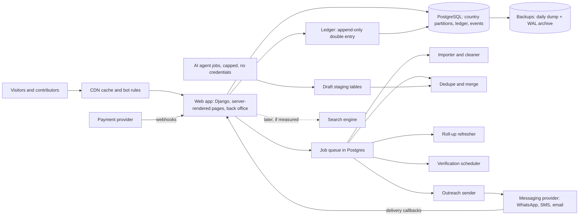

# AllLists.org: project analysis (fundamental and technical)

Prepared 2026-10-05 for the founder. Planning analysis, not legal or financial advice. Every outside figure came from a search summary rather than the original page unless a section says it was measured. Grades on each figure are explained in sections A12 and B14. Nothing in `docs/DECISIONS.md` is reopened.

**How this report is arranged.** The summary below is the part to read first. Part A (sections A1 to A12 and an appendix) is the fundamental analysis: product, market, competition, business model and money, go-to-market, legal risk, risks, valuation. Part B (sections B1 to B14) is the technical analysis: what exists, architecture, data scale, hard problems, security, cost, delivery plan, team, risks. Section numbers inside each part refer to that part.

---

## Summary for the founder

**Verdict.** The project is worth pursuing, but in a narrow form. The structure is sound and the technology is feasible. The weak point is money: nobody has yet been shown to pay. Do not build the full global product now. Run one eight-week paid test on one trade, and decide from the result.

| Area | Verdict | Confidence | Why |
|---|---|---|---|
| The idea and structure (place tree, entries with checks, lists as views) | Sound | High | Cheap to build; matches how data really grows |
| Who pays | **Unproven** | Low | No buyer or maker has been shown to pay. Prices are borrowed from India, the US and vendor blogs |
| Business model | Works only in a narrow form | Medium | A verified-supplier register for export clusters has a real reason to exist. The largest revenue line in the base case (delivered outreach) has the least evidence and the most legal exposure |
| Technology | Feasible at the scale the data really reaches | High (measured, synthetic data) | One database holds 100 million entries. Pages must be published only where they deserve to exist |
| Legal and trust | Manageable but not yet cleared | Medium | Messaging law, source terms, reviews and personal data need counsel before outreach or individuals' lists |
| Execution | Realistic only for one trade at a time | Medium | A single founder cannot run three first trades at once |
| Design | Template ready | Medium | Reviewed twice; real devices and Urdu review still needed |

**Numbers worth remembering** (grades: M measured, D derived, I my estimate, U unverified):

| Item | Value | Grade |
|---|---|---|
| Cost of the first paid test | About USD 750 to 2,200 over eight weeks | I |
| Sialkot surgical supplier revenue on its own | About USD 9,000 to 12,500 a year (1,800 to 2,500 firms, 2% paying, USD 250 a year). One cluster cannot carry a business | D |
| Five-year illustration, cautious case | Revenue about USD 28,000, operating loss about USD 77,000, no break-even | Illustrative |
| Five-year illustration, base case | Revenue about USD 206,000, operating result about +USD 13,000, break-even only in year 5, cash needed about USD 56,000 | Illustrative |
| Five-year illustration, optimistic case | Revenue about USD 1.1 million, operating result about +USD 518,000, break-even in year 2 | Illustrative |
| Share of base-case year-5 revenue that depends on delivered outreach | 49% | Illustrative |
| Biggest swing factor | Cost to verify one record. The base case flips from profit to loss between USD 1.50 and USD 3.00 per record | Illustrative |
| Contributor share | The 50, 40, 30 steps are not what breaks the model; the revenue base they apply to matters more. A cap on how long an entry earns its phase rate (for example 36 months) is suggested | Illustrative |
| Storage | About 1.7 KB per entry; 100 million entries about 175 GB, one Postgres server split by country | M, extrapolated |
| Speed | A list page query took 1.7 ms for a city and 50 ms for a country at 1 million entries | M, synthetic |
| Possible lists versus real ones | Of all list-place combinations, only 0.04% to 0.1% reached 10 entries in the test. Most pages must never be published | M, synthetic |
| Build effort | 20 to 40 person-months for the full system, 10 to 18 for a first system that can take revenue, assuming AI agents write much of the code | I |
| Running cost | About USD 1 to 32 a month at proof stage, USD 217 to 900 at 1 million entries, USD 14,600 to 52,600 at 100 million. At scale AI drafting costs more than servers | I |
| Code today | 22 tests pass (95% line coverage), checks are clean. The backend is a flat list app with a price and should be replaced, not extended | M |

**What both analyses agree on**
1. **Build only as far as the money.** Build nothing beyond a spreadsheet and a static page until a buyer pays for a sample.
2. **Choose one first trade, in writing.** The repository holds three: pharmacies in Lahore or Karachi, eye care in one city, and Sialkot surgical instruments. The analysis favours Sialkot surgical, with a verified-supplier register as the product.
3. **The lever is verification cost and truth.** About USD 1.50 a record and 90% still correct after 30 days is the target.
4. **Outreach is the dangerous part.** Delivered messages have no Pakistani price evidence and carry the heaviest legal exposure, so they come last.
5. **Rotate the exposed secrets now.** The old database password and keys are still in the repository history.

**The five assumptions everything rests on, each with its cheapest test**

| # | Assumption | Test | Pass line |
|---|---|---|---|
| 1 | Someone pays more than three times the verification cost | Pre-sell a 50-firm sample to 5 buyers; quote a badge to 20 makers | 2 of 5 buyers deposit; 2 of 20 makers pay |
| 2 | Verification is cheap and stays true | Verify 200 firms; log time and cost; re-check at 30 days | Cost at most a third of the price; 90% correct |
| 3 | People will do the work for a share and recognition | Two groups: fee plus share, versus share only | Half of checks done; fraud controlled |
| 4 | We may use the data | Written terms from the trade bodies; counsel hours for Pakistan and the UAE | One written agreement; counsel says listing is lawful |
| 5 | We can reach people without a sales force | Outbound to 30 to 50 importers; 20 to 30 quality pages for 90 days | 5 to 10% reply; half the pages indexed |

**Top risks** (both registers agree on the order): no one pays; revenue leans on outreach; verification costs more than buyers pay; messaging-law breach; source terms forbid reuse; volunteers do not finish checks; exposed secrets; thin pages are not indexed by search engines.

**Decisions only you can take**
1. Which first trade (Q-S7 and the wedge choice).
2. How the contributor share is defined (net revenue, a time cap on each entry's phase rate) and what a first volunteer is offered.
3. Domain (.org or .com), a payment route that works from Pakistan, and counsel for Pakistan and the Gulf.
4. The technical stack (Q-S9) and the reuse plan (Q-S10); my default is Django with Postgres.
5. Sign-off of the component specification and the design system (Q-S12, Q-S14).

**The next eight weeks, in short**
- **Weeks 0 to 2:** write to the trade bodies for terms; book counsel hours; rotate secrets; trace 50 firms in public registers; choose the domain and a payment route.
- **Weeks 2 to 8:** verify 200 makers by hand; show a 50-firm sample to 20 to 30 buyers; offer makers a paid badge.
- **Week 8 decision:** pause if, after at least 10 buyer or maker conversations, fewer than 2 pay or deposit, or if cost per verified entry is above a third of the price accepted. Widen only if 5 or more pay, 90% of a sample is still correct at 30 days, and cost is at most a third of price.

**Caveats.** The five-year figures are illustrations built from stated assumptions, not forecasts. Most web figures come from search summaries. The speed tests used synthetic data on one machine without map extensions. The Urdu wording and the design have not been tested on real devices or by a native speaker.

---

# Part A: Fundamental analysis

Prepared 2026-10-05 for the founder. This is an honest assessment, written as an investment analyst would write it: neither selling the idea nor dismissing it. It draws on the work in this repository and adds one transparent scenario model. It is planning research, not legal or financial advice. Nothing in `docs/DECISIONS.md` is reopened; where a decided item carries a risk, the risk is flagged and the decision stands.

**Grades used in tables.** Almost every outside figure in the earlier reports came from a search summary of a source page, not the page itself. Five web searches were added for this report (exchange rate, minimum wage, gateway fees, WhatsApp pricing, junior salaries).

| Tag | Meaning |
|---|---|
| S | Sourced: a published source is cited in the earlier reports (page mostly not opened) |
| D | Derived: my arithmetic from sourced inputs |
| I | My inference or assumption |
| U | Unverified: single secondary source, undated, vendor blog, or sources conflict. Every UNVERIFIED flag I rely on is kept |

**Terms.** *Entry*: one listed business or person. *Paying share*: percent of entries whose owner pays. *Churn*: percent of payers who leave in a year. *Contribution margin*: revenue minus costs that rise with each sale. *Break-even*: the year revenue covers all costs. *Cash needed*: the deepest point of cumulative loss before break-even.

---

## A1. Verdict

**What it is.** A website where every list exists at every place (global to road). Contributors and AI drafts fill the lists. Entries carry verification levels. Buyers cannot download; they choose outreach and the platform delivers it with contacts hidden. Businesses can pay for rank and badges. Contributors share revenue (50, 40, then 30 percent).

**Is it workable?** In a narrow form. The structure (place tree, provenance, verification levels) is sound and cheap. The product with a plausible buyer is a **verified-supplier register for export clusters**, starting with Sialkot surgical instruments. The full vision has no demonstrated payer, and its largest revenue line is its least-evidenced and most legally exposed.

| Question | Answer |
|---|---|
| Biggest strength | A real, unserved verification gap with a legal reason for buyers to care (EU MDR obliges importers and distributors to check manufacturers; Saudi SFDA requires a local authorised agent; quality-failure reports exist), testable for about USD 750 to 2,200 in eight weeks (I). No dedicated, document-checked directory of Sialkot makers was found (S; small Urdu or Chinese directories may have been missed) |
| Biggest weakness | **No one has been shown to pay.** In my base model 49 percent of year-5 revenue comes from delivered outreach: no Pakistani price evidence, the heaviest messaging-law exposure, and lead quality is the standing complaint at both Indian incumbents. Without it, supplier-side revenue alone never breaks even in five years |
| Confidence | **Medium** that "proceed narrowly" is the right next step. **Low** that the full global vision becomes a business (my judgement, roughly one chance in four or five; I). **Low** on every revenue figure: prices are borrowed from India, the US and vendor blogs |
| Recommendation | **Proceed narrowly.** One trade, one buyer story, one eight-week paid test; no outreach to individuals; no build beyond a spreadsheet and a static page until the test passes |
| What would change it | **Pause** if by week 8, after at least 10 buyer or maker conversations, fewer than 2 pay or deposit, or cost per verified entry exceeds one third of the price accepted. **Widen** only if at least 5 pay, at least 90 percent of a sample is still correct at 30 days, and cost per entry is at most one third of price |

Three findings shape the rest.
1. **One cluster cannot carry a business.** Sialkot surgical has about 1,800 to 2,500 firms (U). At 2 percent paying and USD 250 a year that is about USD 9,000 to 12,500 a year (D). The business needs about ten clusters or a buyer-side product.
2. **The repository holds three different first wedges**: pharmacies in Lahore or Karachi (`Data poor launch markets`), eye care in one city (`Service provider sources`), Sialkot surgical (`DECISIONS`, Q-S7). Choose one in writing.
3. **The share arithmetic is not the main danger.** Verification cost and the revenue base the share applies to matter more than 50, 40, 30 (section 5).

---

## A2. The product and the customer

### 2.1 Who pays

| Party | Pays? | Evidence | Grade |
|---|---|---|---|
| Foreign buyers (distributors, brand owners, private-label start-ups) | **Possibly**, for a verified shortlist or delivered enquiries | MDR duty on importers; quality-failure reports; no willingness-to-pay data | U / I |
| Listed makers and suppliers | **Some**: 1 to 3 percent of listings pay at Justdial and IndiaMART, with large sales forces | Justdial 631,530 paid campaigns on 54.7M listings; IndiaMART about 220,000 payers; Alibaba already takes the visibility budget | S / D |
| Institutions (pharma, device vendors, payment firms) | **Possibly**, for statistics or territory licences | Definitive, IMV, PitchBook in the US; no Pakistani buyer found | S for US only |
| Governments | **No evidence** | No government buyer of contributor-built lists found | S (absence) |
| Free visitors and small shops | **No**; they bring traffic | 97 to 99 percent of listings are free at both Indian incumbents | S |
| Listed individuals (tradespeople, doctors, tutors) | **No** | LinkedIn, GitHub, ORCID list people free; buyers pay | S |
| Contributors | **No**, they are paid by share only (CP1) | Decided | |

### 2.2 Jobs to be done

| Segment | The job | Success looks like | Risk to them |
|---|---|---|---|
| Contributors (students, verifiers) | A CV credential and some income without capital | Certificates, visible credit, a share that arrives | Share is late and small; fear of replacement by agents |
| Listed makers | Be found by serious buyers; prove they are real | Enquiries from buyers who check certificates | Paying twice (Alibaba plus this); paid rank mistaken for verification |
| Importers and distributors | Shortlist real makers; meet a due-diligence duty | Certificate numbers, audit dates, evidence tiers | A wrong badge creates liability |
| Governments and trade bodies | Count and certify a sector | Statistics with coverage labels | Roll-ups from uneven coverage mislead |
| Consumers | Find a local provider fast | Names and area, free | Thin pages, stale phones |

### 2.3 What is genuinely different

| Feature | Real difference? | Copyable? | Earns money? |
|---|---|---|---|
| **Merged place hierarchy** | Cheap and elegant (Craigslist, Wikipedia, OpenStreetMap work this way, S). Also creates millions of empty pages that Google's scaled-content policy targets (S) | Yes, in weeks | No; it saves cost and adds SEO risk |
| **Verification levels with who, how, when, evidence** | **Yes.** TDAP, SIMAP, Alibaba and free directories give self-declared badges, not dated evidence (S) | The label yes; the audited history no | Only if buyers pay (untested) |
| **Contributor revenue share** | Unusual: biggest crowds are paid in status or access (S) | Yes | A cost, not income; recruits only if revenue exists |
| **Outreach instead of downloads** | Standard leakage defence (IndiaMART, Thumbtack, Hagiu and Wright, S); fits privacy law | Yes | Closest to lead pricing; needs opt-in, counsel, delivery proof |
| **AI drafts behind a wall** | Cheap first draft, USD 0.04 to 0.20 per record passing checks (I) | Anyone can | No; trust is the price |

---

## A3. Market

### 3.1 Size evidence by segment

| Segment | Evidence | Grade | Meaning |
|---|---|---|---|
| Sialkot surgical | Exports about USD 445M in 2025, down from about 492M in 2024 (2024 also reported at 449M; SIMAP once cited 435M). Firms: 1,800 exporters, 2,500, 3,000, 3,600 SIMAP members. About 95 percent exported | U (counts and values conflict) | Large, fragmented, shrinking under tax and energy pressure. Define "firm" first |
| Sialkot footballs | About USD 257M FY2025-26; a few global brands buy via long contracts | U | Long-tail discovery only |
| Fans (Gujrat, Gujranwala) | About 300 makers (older sources 100 to 450); exports about USD 30M; most output sold at home | S / U | Concentrated, mostly a dealer list |
| Furniture, sanitaryware, Murree | Chiniot (not Faisalabad) holds 3,000 to 4,000 furniture units; ceramics in a slump (undated); Murree 237 to 440+ properties | U | Weaker; hotels face Booking.com |
| Pakistan establishments | 7.14M, of which 3.22M trade; 290,041 registered companies (about 4 percent, D); 0.65 to 1.2M retail outlets (no census) | S | Real data gap; informal does not mean buyers |
| Indian directory money | Justdial FY26 Rs 1,213.9 crore, 631,530 paid campaigns (about USD 220 each, D); IndiaMART about 220,000 payers at about USD 770 (D) | S / D | Small businesses do pay, thinly, via sales forces |
| Revenue per free listing | Justdial about USD 2.55 per active listing a year; IndiaMART about USD 1.90 per storefront (D, FY25 and FY26 mixed) | D | My base case assumes USD 9 to 11 per verified entry, **four to five times** that: the model's most aggressive assumption |
| Property, vehicles | Dubizzle Group USD 183M (2024); Rightmove GBP 425.1M at 70 percent margin | S | Best-evidenced payers; incumbents own supply |
| Urgent trades as firms | Yelp Services advertising USD 947.6M (+8 percent); Urban Company 73.4 percent of revenue from fees | S | Pays when the platform delivers the job |
| Health, B2B data, talent | IMV about USD 11,000 a year; Definitive USD 241.5M (down 4 percent); ZoomInfo USD 1,249.5M (growth 3 percent, retention 89 to 90 percent); Naukri quarterly billings Rs 810.7 crore | S | Health: high value, few buyers, none local. B2B data: big, flat, leaky. Talent: strongest case of paying for a list of people |
| Exporter visibility already bought | Alibaba Gold Supplier about USD 1,500 to 4,700 a year; 3,000+ paid Pakistani members (2018); 85 to 90 percent of paid Pakistani sellers in Sialkot. Implied USD 4.5M to 14M a year (D from U) | U / D | The maker's visibility budget already goes to Alibaba, subsidised 38 to 63 percent via SMEDA |

### 3.2 Where the money is, and where it is not

| Money is here | Not here |
|---|---|
| Property agents, vehicle dealers (owned by Zameen, Dubizzle, OLX) | Restaurants, shops, groceries, beauty: Yelp restaurant and retail advertising fell 6 percent in 2025; Justdial needed a Rs 1,000 entry price for chemists and grocers |
| Urgent trades as firms (job worth hundreds of dollars) | Schools as a revenue list: top search demand, no payer; Shiksha billings fell 13 percent. Use as a free traffic anchor |
| B2B suppliers: machinery, construction materials, packaging, electronics (about 27 percent of IndiaMART payers, date unclear) | Bare contact files: USD 0.002 to 1.30 a record; free data sets the ceiling at zero |
| Export clusters with a verification problem (I) | Education leads, handyman jobs (USD 8 to 25 a lead) |
| Health facilities and equipment; talent (after consent-based build) | Plumbers in one housing society: pays by the job, highest legal risk |

### 3.3 Pakistan, Gulf, global

| Market | Role | Evidence | Weakness |
|---|---|---|---|
| **Pakistan** | Where data is made; some local buyers | Labour about USD 1 to 3 an hour (S); Punjab minimum wage PKR 40,000 a month, about USD 144 at PKR 278 (web search); wallets and Raast work | Weak local willingness to pay; B2B apps raised USD 161.4M and retrenched (S); no Stripe or PayPal for Pakistan-registered firms (S/U) |
| **Gulf (UAE first)** | Where it is sold: buyers, card rails, corridor (about 2M Pakistanis; Pakistan exports to UAE about USD 1.92B, S/U) | Dubizzle EBITDA margin 46 percent (S) | Do-not-call register: 3,301 violations and AED 19.19M in fines by June 2026 (S); cheap vendors sell UAE company files |
| **Global buyers** (US, UK, EU) | Buy lists made elsewhere | US local ad spend USD 171B (S); MDR duties on importers (S) | Highest legal exposure, incumbents, free data |

### 3.4 What global-from-day-one does to focus

1. **Empty cells.** Every list at every place makes millions of near-empty pages, the pattern Google's policy treats as spam (S). Enforce the register's own rule (C16, J5): publish only cells with at least 10 verified entries, a map, statistics and a last-verified date.
2. **Legal reach from the first entry.** A contribution about a business in any country raises that country's duties (P11). Structure global; switch on selling and outreach one country at a time.
3. **Attention.** Every durable marketplace won one dense unit first; Zomato (nine countries), Groupon (seven) and Jumia retrenched after going wide (S). The risk is founder time, not the database.

---

## A4. Competition and substitutes

### 4.1 What each competitor teaches

| Competitor | Economics | Lesson |
|---|---|---|
| **Google** (Maps, Business Profile, Local Services Ads) | Free listing; paid leads in set verticals (about USD 53 average, S/U); Business Profile 58.6 percent listing share in Pakistan (U) | Owners already maintain Google free; a directory cannot enter the map pack; AI summaries cut clicks (Pew 8 versus 15 percent, S) |
| **Justdial** | About 1.2 percent of listings pay; 10,472 sales staff (undated, U); profit flattered by treasury income | The tail pays only through a field force. Paid Rs 15 a record in 2010 (unconfirmed, U) |
| **IndiaMART** | Top 10 percent of payers about 50 percent of revenue; Silver churn about 7 percent a month versus 1 percent for Gold; a Silver price rise cost three quarters of falling payers (S) | Sell to the thin top first; never raise the entry price sharply; sell annual terms |
| **Alibaba** | Gold about USD 1,500 to 4,700, Verified about USD 12,500 (U); 2011 fraud scandal from sales staff paid on signings (S) | The maker has a budget and a habit. A badge in the low hundreds sits between free and Verified (I). Pay sellers on renewals |
| **TDAP, SIMAP, SCCI, Pakistan Trade Portal** | Free, official, partly stale | Source and rival at once. Partner first; get written terms |
| **Free open data** (Overture about 64 to 70M, Foursquare about 105M places) | Free for commercial use; Overture 81 to 95 percent accurate by confidence (S) | Generic place lists are priced at zero |
| **AI agents and scrapers** (Apify, Outscraper) | Raw records USD 1 to 6 per 1,000; money flows to workflow layers (Clay about USD 150M ARR, estimate, U) | Drafting is a commodity; no funded AI-built local directory with revenue found |
| **ZoomInfo, D&B, trade fairs, sourcing agents** | ZoomInfo retention below 100 percent; D&B profitable at scale; agent commission 2 to 10 percent (S) | Data subscriptions are high margin and leaky; fairs and agents are the buyer's current channel, so a list must beat a fair stand per qualified contact |
| **Precedents that ended** | Mocality (100,000+ free listings) shut in Nigeria and Kenya; Jigsaw sold for about USD 142M and its product was later deleted (S) | Scale and exit did not mean a lasting business |

### 4.2 Moat

| Asset | Copyable? | Durable? |
|---|---|---|
| Place tree, taxonomy, schema, site code (code is open, A3) | Yes, in weeks | No |
| Raw maker lists, AI drafting pipeline | Yes, in days | No |
| **Dated evidence history** (who checked what, when; re-checks; accuracy per source) | Not backdatable; months to years | **Yes, if buyers rely on it** |
| **Owner claims and consent records** | Hard; each is a relationship | Yes |
| **Reply and outcome data** from delivered enquiries | Cannot be scraped; needs buyers first | Yes, later |
| Trade-body agreements | A rival can sign too (no exclusivity planned) | Partly |
| Contributor community | Rivals can recruit; most OpenStreetMap members never edit (S) | Weak |

**Conclusion.** The moat is not the list. It is a long, honest, audited record and a set of owner relationships. It is worth something only if a buyer pays for it. Free baseline data keeps improving, so a moat built on "AI-built basic listings" erodes (S).

---

## A5. Business model and unit economics

### 5.1 Revenue streams, ranked

| Rank | Stream | Evidence for | Evidence against | Timing |
|---|---|---|---|---|
| 1 | Free pages with ads | Free base is the funnel | Pakistan ad prices unreliable; AI cuts clicks | Day one; small |
| 2 | **Delivered outreach** | Closest to lead pricing (IndiaMART Rs 22 to 33 a lead versus US USD 39 to 150) | Heaviest legal risk; no Pakistani price; Pakistan WhatsApp rates rose April 2026, rate not found | After counsel |
| 3 | Paid badge, rank, extra fields | Rightmove agency subscriptions 72 percent of revenue at 70 percent margin; IndiaMART Verified Exporter Rs 1.15 to 6.5 lakh | Only 1 to 3 percent pay; Alibaba already sells to makers | After traffic and claims |
| 4 | Low recurring subscription | Crunchbase Pro about USD 49 a month (U); PitchBook grew by licences | ZoomInfo retention 89 percent | Test with institutions |
| 5 | Heavy download (about USD 1,000) | Protection against copying | No sourced buyer; USD 2 a record at 500 entries is above every marketplace price | Test price only |
| 6 | Institutional licences, statistics, custom research | D&B, Definitive services revenue | No government buyer found | Year two on |
| Avoid | Commission, logistics, print, daily deals | | Udaan lost about Rs 1,674 crore on Rs 5,707 crore of sales (FY24); Pakistani B2B apps | Last, partners only |

### 5.2 The scenario model

**These are illustrations, not forecasts.** Every input is my assumption (I), anchored to a benchmark where one exists. The script is in the appendix. USD per year, years 1 to 5. Conversion about PKR 278 per dollar (web search, open-market quote 28 September 2026).

**Logic.** Supplier revenue = average payers x price, where payers = verified entries x paying share. Outreach = paying buyers x annual spend. Subscriptions = seats x price. Downloads and custom research = count x USD 1,000. Costs: verification on each new record plus a 40 percent yearly re-check; payment fees 3.5 percent of revenue (Safepay: card 2.9 percent plus Rs 30 domestic, 3.2 percent international, bank 2.5 percent) and 3 percent on payouts; outreach delivery 25 percent of outreach revenue; seller commission 15 percent of supplier revenue, paid on renewals. **Contributor share** steps 50, 40, 30 percent by date phase, **locked per entry** (entries added in years 1 and 2 earn 50, years 3 and 4 earn 40, year 5 earns 30); the blended rate is entry-weighted. The share applies to supplier, subscription and download revenue and, at half rate after delivery cost, outreach, but only on entries a human sourced (60, 50, 40 percent of entries). Agent, registry-seeded and self-listed entries earn nothing (D5, D8).

| Input | Cautious | Base | Optimistic | Anchor |
|---|---|---|---|---|
| Verified entries, end of year 1 to 5 | 300, 800, 1,800, 3,200, 5,000 | 600, 2,000, 5,000, 10,000, 18,000 | 1,000, 4,000, 12,000, 28,000, 55,000 | Sialkot 1,800 to 2,500; pilot 200; more clusters later (I) |
| Paying share | 1.0% | 2.0% | 3.0% | Justdial 1.2 to 1.3%, IndiaMART 2.6% (D); Q-S7 test 2.5% |
| Price per payer per year | USD 120 | USD 250 | USD 500 | Small-directory upgrade USD 10 a month (U); Justdial USD 220; IndiaMART USD 770 (D) |
| Supplier churn per year | 40% | 25% | 15% | IndiaMART Silver about 58%, Gold about 11% a year (D) |
| Paying buyers, years 1 to 5 | 2, 8, 20, 35, 55 | 6, 20, 60, 130, 250 | 12, 50, 150, 350, 700 | No Pakistani evidence (I) |
| Spend per buyer per year | USD 250 | USD 400 | USD 600 | IndiaMART lead Rs 22 to 33; generic B2B lead USD 40 to 650 (U) |
| Subscription seats, years 1 to 5 | 0, 1, 3, 6, 10 | 1, 4, 10, 20, 35 | 2, 8, 25, 55, 100 | USD 500 to 600 a seat (U) |
| Downloads and custom per year | 0, 1, 2, 3, 4 | 1, 3, 6, 10, 15 | 2, 6, 12, 20, 30 | USD 1,000 test price |
| Verification cost per new record | USD 3.00 | USD 1.50 | USD 0.60 | Phone-confirmed shop USD 0.10 to 0.45 (D); supplier records need documents (I) |
| Seller capacity, new payers per seller-year | 60 | 120 | 200 | No benchmark (I) |

**Fixed costs (base).** Founder unpaid in years 1 and 2, USD 6,000 a year from year 3. Build USD 5,000 in year 1. Operations FTE 0.5, 1, 2, 3, 4 at USD 4,000 (Lahore junior pay PKR 40,000 to 83,000 a month, web search). Developer FTE 0.5, 0.5, 1, 1.5, 2 at USD 8,000. Sellers computed from gross new payers (the founder sells in year 1). Hosting USD 600 to 15,000; legal USD 2,000 to 15,000; other USD 1,500 to 12,000; marketing the larger of USD 1,000 or 8 percent of revenue. Cautious and optimistic use their own team and legal schedules (in the script). No file prices hosting, legal or engineering; the research itself calls engineering the largest unpriced item.

### 5.3 Results

**Base case (USD).**

| | Y1 | Y2 | Y3 | Y4 | Y5 |
|---|---|---|---|---|---|
| Verified entries | 600 | 2,000 | 5,000 | 10,000 | 18,000 |
| Paying suppliers | 12 | 40 | 100 | 200 | 360 |
| Supplier revenue | 1,500 | 6,500 | 17,500 | 37,500 | 70,000 |
| Outreach revenue | 2,400 | 8,000 | 24,000 | 52,000 | 100,000 |
| Subscriptions | 600 | 2,400 | 6,000 | 12,000 | 21,000 |
| Downloads and custom | 1,000 | 3,000 | 6,000 | 10,000 | 15,000 |
| **Revenue** | **5,500** | **19,900** | **53,500** | **111,500** | **206,000** |
| Contribution margin (percent) | 2,552 (46) | 9,932 (50) | 28,578 (53) | 61,385 (55) | 118,192 (57) |
| Fixed costs | 16,100 | 21,342 | 47,780 | 73,670 | 105,480 |
| **Operating result** | **-13,548** | **-11,410** | **-19,202** | **-12,285** | **+12,712** |
| Cumulative cash | -13,548 | -24,958 | -44,159 | -56,445 | -43,732 |
| Break-even revenue | 34,691 | 42,762 | 89,446 | 133,815 | 183,843 |

**Three scenarios.**

| | Cautious | Base | Optimistic |
|---|---|---|---|
| Year-5 revenue | USD 27,670 | USD 206,000 | USD 1,132,500 |
| Year-5 contribution margin | 32% | 57% | 66% |
| Year-5 operating result | -76,907 | +12,712 | +518,081 |
| First profitable year | none in 5 | year 5 | year 2 |
| **Cash needed** | **about USD 212,000 by year 5, still falling** | **about USD 56,000 (year 4)** | **about USD 5,500 (year 1)** |
| Outreach share of year-5 revenue | 50% | 49% | 37% |

**Reading the results.**
- **Cautious:** a lean variant (quarter-time operator and developer, minimal legal, founder unpaid) still loses about USD 12,900 in year 5 and USD 57,600 in total, roughly USD 1,000 a month. That is a hobby with a cash cost, not a company.
- **Base:** break-even only in year 5, needing about USD 56,000 plus two years of unpaid founder time, and about 16,000 verified entries at USD 11.44 revenue each (D).
- **Optimistic:** profitable almost at once on almost no cash. That is the shape of a business that has found a buyer, and why the first eight weeks matter more than any later build.
- **Revenue per entry is the stretch.** Base assumes USD 9.17 rising to 11.44 per verified entry, against about USD 2.55 (Justdial) and USD 1.90 (IndiaMART) per free listing (D). At about USD 4 per entry the base case does not break even (my reading).
- **Outreach is the hinge.** With outreach at zero the base year-5 loss is USD 43,700 and cash need about USD 148,000. With supplier revenue only (no outreach, subscriptions or downloads) year-5 loss is USD 68,800.
- **Variable costs are 43 percent of base year-5 revenue:** delivery USD 25,000, contributor pool USD 26,308, fees USD 7,999, verification USD 18,000, commissions USD 10,500.

### 5.4 Sensitivity

One input changes at a time; everything else stays at base. USD.

**Paying share** (price USD 250)

| Share | Y5 operating result | Cash needed | First profitable year |
|---|---|---|---|
| 0.5% | -9,211 | 83,122 | none |
| 1.0% | -1,903 | 69,992 | none |
| **2.0% base** | **+12,712** | **56,445** | **5** |
| 3.0% | +27,328 | 42,550 | 5 |
| 4.0% | +44,194 | 35,822 | 4 |

**Verification cost per new record**

| Cost | Y5 operating result | Cash needed | First profitable year |
|---|---|---|---|
| USD 0.25 | +27,712 | 40,145 | 5 |
| USD 0.75 | +21,712 | 46,665 | 5 |
| **USD 1.50 base** | **+12,712** | **56,445** | **5** |
| USD 3.00 | -5,288 | 81,292 | none |
| USD 6.00 | -41,288 | 156,412 | none |

**Churn, with selling capacity fixed** (higher churn lowers net payers)

| Churn | Payers at end of Y5 | Y5 operating result | Cash needed |
|---|---|---|---|
| 10% | 410 | +17,596 | 53,827 |
| **25% base** | **360** | **+12,712** | **56,445** |
| 40% | 318 | +8,562 | 58,823 |
| 58% (IndiaMART Silver-like) | 278 | +4,402 | 61,385 |

**What it says.**
1. **Price and paying share move the answer most.** At USD 500 a payer, break-even moves to year 4 with year-5 profit of USD 50,944; at USD 120 it never comes. At 3 percent paying and USD 0.75 per record, year-5 profit is USD 36,328; at 1 percent and USD 6.00 it is a loss of USD 55,903.
2. **Verification cost is a cliff.** Between USD 1.50 and USD 3.00 a record the business flips from marginal profit to loss. The 200-firm pilot measures this. It is the cheapest decisive measurement available.
3. **Churn is second-order here**, because supplier subscriptions are about a third of revenue. It would dominate in an IndiaMART-style supplier product. The IndiaMART lesson stands: avoid a cheap entry tier that churns at 7 percent a month.
4. **Outreach volume is the largest driver of all.** Halving paying buyers gives a year-5 loss of USD 15,497 and a cash need of USD 95,839. Raising them by half breaks even in year 4.

### 5.5 Contributor-share arithmetic, and the step-down

**Per entry (base).**

| Year | Revenue per verified entry | Blended contributor rate | Pool per human-sourced entry | Platform margin on revenue |
|---|---|---|---|---|
| 1 | USD 9.17 | 50% | USD 3.33 | 46% |
| 2 | USD 9.95 | 50% | USD 3.73 | 50% |
| 3 | USD 10.70 | 44% | USD 3.39 | 53% |
| 4 | USD 11.15 | 42% | USD 3.32 | 55% |
| 5 | USD 11.44 | 37% | USD 2.92 | 57% |

Pool per human-sourced entry in year 5 is USD 1.45 (cautious) and USD 5.67 (optimistic); the total year-5 pool is USD 4,349, 26,308 and 124,647.

**What a contributor would earn (assumptions).** Verifying a record takes about 3 to 5 minutes (earlier reports, I), so 1,000 records is 50 to 83 hours. In the base case a contributor who sourced 1,000 entries earns about USD 3,300 a year once they sell, about USD 40 to 65 an hour of verification time and about twice the Punjab minimum wage of USD 1,727 a year (D). That is attractive **if the revenue exists**. In year 1 the whole base pool is USD 1,000, about USD 50 each across 20 volunteers; in the cautious case it is USD 110. Non-cash rewards (CP9) carry year 1. At cent-level record prices (USD 0.05 to 0.075) a 30 to 50 percent share pays under four cents a sale (earlier report); the model avoids that only by assuming a verified B2B entry earns about USD 10 a year. If that fails, the share is meaningless.

**Does the 50, 40, 30 step-down make sense?** (Working inside the decision.)

| Question | Finding |
|---|---|
| Does by-date step-down with lock per entry behave sensibly? | It decays slowly. The blended rate is still 37 percent in year 5, not 30. The platform keeps about 63 percent of attributable revenue, not 70 |
| Is the share what breaks the model? | No. It is 12.8 percent of base year-5 revenue. Verification and a thin revenue base matter more |
| Which choice moves the result most? | The **revenue base** (open as Q-N2, P9). If the share applies to buyer-side revenue only, not to what a listed supplier pays for badge or rank, base year-5 profit rises from USD 12,712 to USD 25,931 and cash need falls from USD 56,445 to USD 42,308: about the size of the whole base-case profit |
| Does a lifetime 50 percent lock create risk? | Yes. The earliest entries are the cluster core and grow most valuable; a permanent 50 percent cannot be undone without breaking a promise |
| Is early generosity cheap? | Yes: 50 percent of near-zero revenue. The cost arrives later |
| Does it recruit? | Not alone. No evidence shows revenue share recruits for a B2B directory; Quora paid to seed supply and then stopped (S) |

**Suggestions (not reopening the decision).** (1) Fix now that the share applies to net revenue (after fees and delivery cost), buyer-side first. (2) Cap how long an entry earns its phase rate, for example 36 months, then the lowest rate. (3) Keep agent, registry-seeded and self-listed entries at zero (D5, D8). (4) Publish the payout rulebook with notice periods; it is a trust asset (S). (5) Add a small fixed fee per audited record if pilots show volunteers do not finish checks (P16, open). (6) Ask counsel whether holding contributor balances needs a payment licence.

---

## A6. Go-to-market and sequencing

One cluster, one city, a verified-supplier register, a paid pilot, then roll-out. Write each threshold down before the test. Thresholds are hypotheses (H) from the earlier reports. Gate 1 is the Q-S7 test (verify 200 firms; 5 pay or 5 foreign buyers send enquiries in 6 to 8 weeks).

| Gate | When | Test | Pass metric | Kill criterion |
|---|---|---|---|---|
| **0. Paper checks** | Weeks 0 to 2 | Open the TDAP brochure, SIMAP, SCCI, DRAP list and Trade Portal pages; email each body for written terms; one counsel hour each for Pakistan and the UAE; trace 50 firms in DRAP, FDA, EUDAMED, IAF CertSearch | One body agrees in writing, or open sources (FDA registration is CC0) give enough identity proof; counsel says business-contact listing is lawful | No permission and no usable open source; counsel says unlawful |
| **1. 200-firm pilot** | Weeks 2 to 8 | Verify 200 makers by evidence tier; log minutes and cost; show a 50-firm sample to 20 to 30 buyers; offer makers a paid badge | At least 2 of 5 targeted buyers deposit at 3 times cost per entry; 5 payers or 5 foreign buyers send enquiries; cost at most USD 1.50; at least 90 percent correct at 30 days | No buyer pays after 10 conversations; cost above one third of price; under 90 percent accurate |
| **2. Paid maker pilot** | Months 3 to 6 | Quote 20 to 30 makers with checkable CE, ISO 13485 and MDR status a badge at USD 100 to 300 for 3 months; keep paid rank apart from verification | At least 2 of 20 pay (10 percent, above the 1 to 3 percent benchmark) | None pays, or "Alibaba covers it" |
| **3. Complete the unit** | Months 6 to 12 | At least 1,800 identity-proofed Sialkot surgical entries (not the 3,600 headline); re-check a sample; 20 to 30 quality pages | 30-day freshness at least 90 percent; half the pages indexed by day 90, 30 percent with an impression; renewals hold | Under 20 percent indexed at day 90; under half renew |
| **4. Second cluster** | Months 12 to 18 | Fans (Gujrat, Gujranwala, about 300 makers), then footballs or building materials | Unit two matches unit one faster, with less paid effort | Same effort as unit one |
| **5. Gulf buyers** | After counsel | UAE buyers, consent-based only | Paid orders; counsel clears messaging and the do-not-call register | Approval needed and unobtainable |
| **6. Delivered outreach** | After gates 2 and 5 | Opt-in enquiries to claimed makers only | Buyers re-buy; half of enquiries answered; no complaint | Low replies or any regulator complaint |
| **7. Widen** | After 4 and 6 | One trade or country at a time; paid rank last | Each unit self-sustaining | Fraud, support load or legal queries rise faster than revenue |

**Do not:** build a public site at scale; message agent-sourced numbers; list named individuals before counsel; sell rank inside the verified layer; assume India is open; build a commerce layer; pay sellers on signings.

---

## A7. Legal, regulatory and reputational risk

Planning research, not legal advice; primary texts mostly not opened. Counsel is already decided as a precondition for messaging tests, individuals, health or child data, and the talent list.

### 7.1 By country

| Country | Messaging | Personal data | Status |
|---|---|---|---|
| **Pakistan** | PECA spamming offence (s.25 in one index, s.22 in another; counsel to confirm): Rs 50,000 first offence, up to Rs 1M repeat; PTA bulk-SMS rules | No enacted law as of May 2026; bill unsettled | A window, not a safe harbour. Business-contact data **open** |
| **UAE** | Do-not-call register covers calls, SMS, emails even with consent; hours 9am to 6pm; approval needed | PDPL since 2022; regulations' status conflicts | **Open**: whether business recipients are covered |
| **Saudi Arabia** | B2B treatment not found | PDPL needs documented marketing consent; fines up to SAR 5M | **Open**; MISA licence question |
| **Turkey, India** | Turkey: merchants can be messaged without prior consent (opt-out in 3 days). India: DPDP consent plus TRAI do-not-call | India core duties from 13 May 2027 | Turkey easiest B2B, thinly researched; India a benchmark, cross-border trade unexamined |
| **UK, EU** | UK: sole traders need consent; Germany needs B2B consent; France opt-out | GDPR; KASPR fined EUR 240,000; Lusha reportedly EUR 2M (single source) | Buyer markets |
| **US** | CAN-SPAM covers B2B email; TCPA suits about doubled in H1 2025 | CCPA covers business contacts; data-broker registration in four states; California DROP from 1 August 2026 | Buyer market |
| **Nigeria, Kenya, Bangladesh, Egypt, China** | Egypt needs a marketing licence; China consent and licensed operator | Nigeria directive Sept 2025; Kenya fines to KES 5M; Bangladesh ordinance status unverified; Egypt enforcement 31 October 2026; PIPL no business-contact carve-out | Not first |

### 7.2 Decided and open

| Area | What is known | Decided or open |
|---|---|---|
| **Scraping and licences** | Red: Google Maps, Facebook, Baidu and Amap, logins, anti-bot bypass, bought lists. Amber: chamber lists, registers, business websites. Green: Overture (per-record licence), Foursquare (Apache-2.0), GeoNames, owner submissions. OSM is share-alike; keep separate. DRAP's list disclaims "research, citation, statistical analysis" (relayed, U) | **Decided:** red out pending counsel; every record keeps source, licence, date, consent (D17). **Open:** each register's terms (Q-S3) |
| **Database rights** | No sui generis right found in Pakistan; EU database right and contract terms can bind; US no copyright in facts | Open; protect by contract, planted trace entries, limits |
| **Health data, price ads** | Punjab Healthcare Commission can regulate service prices; DRAP ad rules; Saudi fee caps | **Decided:** dated prices, no "cheapest", labelled paid placement, no patient data. **Open:** counsel per country (Q-S1) |
| **Child data, tutors** | Safeguarding, relay-only contact | **Decided:** not public until designed; schools and centres first |
| **Named individuals** | Personal data; sole traders count in UK and EU | **Decided:** consent only, area only, relay contact |
| **Reviews** | US FTC fake-review rule (effective 21 October 2024); EU Omnibus disclosure of verified reviews | **Decided:** verified users, one per user, separate from paid rank. **Open:** who may review (Q-P3) |
| **EU DSA** | Art 16 notice and action; Art 26 ad labels; Art 30 trader traceability conflicts with hidden contacts if AllLists is a consumer marketplace | **Open:** likely not applicable if B2B only; verify before any EU consumer launch |
| **Contributor payments** | Holding balances may need a licence (not researched); worker classification; no recruitment commissions (decided); 2 percent digital-payments sales tax; 5 percent creator withholding proposed (final form unverified) | **Open:** counsel hour |
| **"Verified" claims** | Defamation if wrong; claims about named makers need evidence | **Open:** counsel on badge wording |

### 7.3 Reputational

| Risk | Why |
|---|---|
| Child labour and sub-contract chain (ETI and PILER 2020) | State that lists cover the factory tier only; never imply a clean supply chain |
| Quality scandals (stainless reports; scope unverified for Sialkot) | One wrongly badged firm harms the badge |
| Pay-to-rank read as verification (Alibaba 2011) | Two labels, two processes |
| Contributor pay seen as exploitative (Kenyan labellers at USD 1.32 to 2 an hour drew criticism) | Publish rules; careful with "USD 1 to 3 an hour" framing |
| Exposed credentials in the public repository (M9) | Rotate now; a leak undermines "trust" as the product |

---

## A8. Risk register

Likelihood (L) and impact (I) on a 1 to 5 scale; score is the product; ranked by score. Owners are roles.

| # | Risk | L | I | Score | Owner | Mitigation | Early-warning signal |
|---|---|---|---|---|---|---|---|
| 1 | **No one pays** for a verified or contributor-built list | 4 | 5 | 20 | Founder | Pre-sell first; gates 1 and 2 | Under 2 of 5 deposits after 10 conversations |
| 2 | Revenue leans on outreach: no price evidence, heaviest law exposure | 4 | 5 | 20 | Founder, counsel | Sell lists and badges first; test supplier-only break-even | Supplier run-rate under cost by month 6 |
| 3 | Verification costs more than buyers pay (cliff near USD 3) | 3 | 5 | 15 | Ops lead | Measure in pilot; tier evidence; owner claims | Over 10 minutes a record |
| 4 | Messaging-law breach (PECA, PTA, UAE register, WhatsApp opt-in) | 3 | 5 | 15 | Counsel | No sends until cleared; opt-in; official API | Any complaint; number flagged |
| 5 | Source terms forbid reuse (TDAP, SIMAP, DRAP disclaimer) | 3 | 4 | 12 | Founder | Written terms; open registers; owner submissions | No reply in 4 weeks |
| 6 | Three competing first wedges in the repository | 4 | 3 | 12 | Founder | Choose one in writing | Time split across trades |
| 7 | Alibaba and free official channels satisfy makers | 3 | 4 | 12 | Founder | Sell the verification layer below Alibaba Verified | "I already have Alibaba" |
| 8 | Wrong or stale badge causes harm or defamation | 3 | 4 | 12 | Ops lead, counsel | Badge states what and when; 12-month expiry; takedown route | Complaint |
| 9 | Single founder: time, burnout | 4 | 3 | 12 | Founder | One cluster; playbook; part-time operator by month 3 | Pilot beyond week 10 |
| 10 | Volunteers do not finish checks; share-only pay does not recruit | 4 | 3 | 12 | Ops lead | Two-group test; non-cash rewards; small audited fee | Under half of checks done in 3 weeks |
| 11 | Fraud: fake entries, verifiers, claims | 3 | 4 | 12 | Ops lead | Seeded fakes, blind sampling, evidence, clawback | Fake rate over 2 percent |
| 12 | Payment rails unworkable (no Stripe or PayPal for Pakistan firms) | 3 | 4 | 12 | Founder | Test one gateway and one wallet payout | Payout cost over 5 percent or over 7 days |
| 13 | One cluster is too small (about USD 10,000 a year) | 4 | 3 | 12 | Founder | Plan ten clusters or a buyer product | Year-1 supplier revenue under USD 2,000 |
| 14 | Google thin-page policy and AI summaries starve traffic | 4 | 3 | 12 | Engineer | Index only filled pages; judge at day 90 | Under 20 percent indexed at day 90 |
| 15 | Cash runs out before break-even (base about USD 56,000) | 3 | 4 | 12 | Founder | Spend by gate; prepaid annual terms | Spend 25 percent over plan |
| 16 | Exposed credentials; code does not run | 3 | 3 | 9 | Engineer | Rotate secrets; static prototype only | Unauthorised access |
| 17 | Gulf messaging approval unobtainable | 3 | 3 | 9 | Counsel | Sell by invoice and list, not outreach | Counsel answer |
| 18 | Exchange-rate and inflation shock | 3 | 3 | 9 | Founder | Dollar prices for foreign buyers; rupee costs | PKR move over 10 percent in a quarter |
| 19 | Open data and agents commoditise drafts | 4 | 2 | 8 | Founder | Sell evidence history and claims | Buyers cite free options |
| 20 | Contributor balances need a licence; classification or tax rules | 2 | 4 | 8 | Counsel | Counsel hour; non-cash first | Licence required |
| 21 | Lifetime 50 percent share becomes a liability | 2 | 4 | 8 | Founder | Cap duration; net base | Contributors ask for written terms |
| 22 | Child-labour or quality scandal at a listed firm | 2 | 4 | 8 | Ops lead | Factory-tier wording; show audit status, not claims | Press or buyer query |
| 23 | Paid rank erodes trust in verification | 2 | 4 | 8 | Founder | Separate labels and owners | Buyers stop trusting the badge |
| 24 | Domain confusion (.org versus .com) | 2 | 2 | 4 | Founder | Own both; redirect | Lost traffic or email |

---

## A9. SWOT

| | Helpful | Harmful |
|---|---|---|
| **Internal** | **Strengths.** Cheap, testable wedge. Verification levels with evidence and dates. Decisions and source rules already written. Provenance built in, so data can enter stricter markets. Graded research record. Founder close to Pakistan's supply side | **Weaknesses.** No payer yet. Founder alone and non-technical. Code does not run; secrets exposed. Three wedges in the documents. Revenue leans on the riskiest product. No acquisition cost, Pakistani price evidence or sales force. Payments for a Pakistani entity unresolved. Global scope dilutes focus |
| **External** | **Opportunities.** MDR and SFDA duties push buyers to verify. Alibaba and free channels lack document-checked evidence. Gulf corridor. Light personal-data law in Pakistan today. Cheap AI drafting. Other clusters with trade bodies. Later: statistics and demand intelligence | **Threats.** Alibaba (SMEDA-subsidised) or TDAP could add verification. Free data and agents compress price. Google and AI summaries cut traffic. A Pakistani data law or UAE enforcement could close the window. Sialkot exports falling. Funding cliff (Pakistani startup funding down 95 percent in Q2 2023, S). Quality or labour scandals |

---

## A10. Valuation and funding view

### 10.1 Value by stage (qualitative)

No file grounds a pre-revenue valuation, so these are stages and reasons, not numbers.

| Stage | What exists | What a buyer or investor would value | Value |
|---|---|---|---|
| Today | Research, decisions, static prototype | The plan | Near zero |
| After Gate 1 | 200 verified firms, measured cost, 2 to 5 deposits | Proof someone pays; a repeatable method | Small |
| After Gate 3 | One complete cluster, renewals, freshness data | Customers, retention, evidence history | Modest niche data business |
| After Gates 4 and 6 | Two or three clusters, outreach with reply data | A playbook plus buyer-side revenue | Meaningful to a trade body, B2B data buyer or strategic partner |
| Wide roll-out | Many units, claimed entries, sales force | A scaled directory or data asset | Large only with shown growth and retention; Jigsaw shows an exit need not last |

### 10.2 Benchmarks from the files

| Benchmark | Figures | Grade | Use |
|---|---|---|---|
| Dun & Bradstreet take-private (2025) | Enterprise value USD 7.7B; 2024 revenue USD 2.38B; adjusted EBITDA USD 926.6M: about 3.2 times revenue, 8.3 times EBITDA | S; D | A mature ceiling, not a comparable |
| D&B multiples applied to the model | Base year 5: revenue USD 206,000 gives about USD 0.67M; profit USD 12,712 gives about USD 0.11M. Optimistic year 5: revenue USD 1.13M gives about USD 3.7M; profit USD 518,081 gives about USD 4.3M | D, I | Scale only: a bootstrapped base case is worth hundreds of thousands, not millions; likely overstated |
| Jigsaw (Salesforce, 2010) | About USD 142M for 22M contacts and 1.4M contributors: about USD 6.45 a contact, USD 101 a contributor; product deleted by July 2020 | S; D | Closest crowd-data exit; value need not last |
| Reliance in Justdial (2021) | 40.95 percent for Rs 3,497 crore: about Rs 8,540 crore for 100 percent | S; D | Strategic buyers pay for merchants and audience |
| Sensis (Australia) | 70 percent for A$454M in 2014 (about A$649M for 100 percent, D); 100 percent for about A$250 to 260M in 2021 | S; D | Directory assets can lose over half their value in seven years |
| Thryv print directories; Stack Overflow; Wish; Clay | USD 142M sale; USD 1.8B purchase with 68 percent write-down (reported); USD 14B at IPO to USD 173M asset sale; Clay USD 5B on estimated ARR USD 150M, about 33 times, mixed dates (U) | S / U | Legacy and traffic assets fall; capital flows to workflow layers, not lists |

### 10.3 Founder time and cash with no spending

The decided view (C28) is to launch with no spending. That is realistic only for about eight weeks.

| Item | Estimate | Grade |
|---|---|---|
| Founder time, Gates 0 and 1 | 20 to 30 hours a week for 8 weeks | I |
| Cash, Gates 0 and 1 | USD 750 to 2,200: verifying 200 firms at USD 1.50 to 6.00 (USD 300 to 1,200); two counsel hours (USD 300 to 800); payment test and domain (about USD 150) | I (no file prices these) |
| Costs that cannot be zero | Counsel, a payment-collection route, verification labour, phone and data | I (from C28's own open list) |
| Founder time, months 3 to 12 | Half to full time; unpaid in the model through year 2 | I |

The base case needs about USD 56,000 before it turns profitable, plus about two years of unpaid founder time. The cautious case, spent at the same pace, needs over USD 200,000 and does not return it. **Spend should follow the gates, not the plan.**

### 10.4 Funding options

| Option | Requires | Fit | Caution |
|---|---|---|---|
| **Founder plus customer prepayment** | Annual terms or deposits up front (IndiaMART carries Rs 1,678 crore deferred revenue, S) | Best | Needs a buyer, which is the test |
| **Services revenue** | Custom research, verified shortlists | Early cash | Distracts from product |
| **Grants, incubators, trade-body co-funding** | A written pilot with SIMAP, SCCI or TDAP; public benefit | Plausible (TDAP already subsidises fair stands) | Not researched |
| **Angel or seed** | Paid traction, measured cost per record, clean data rights, counsel, an entity, founder plus operator | After Gate 2 | Pakistani funding fell about 95 percent in Q2 2023; Airlift raised USD 85M and shut (S) |
| **Strategic partner** | A buyer who gains from verification: an exporter association, certifier, B2B platform | Natural exit | Dependence; a rival such as Alibaba could copy |
| **Debt** | None suited | None | Debt sank the legacy directories (S) |

---

## A11. What would make it fail, and what would make it work

| # | Assumption | If false | Cheapest test | Cost, time | Pass line |
|---|---|---|---|---|---|
| 1 | **Someone pays** more than three times verification cost | No revenue | Pre-sell a 50-firm sample to 5 buyers; quote a badge to 20 makers | Near zero, 4 to 6 weeks | 2 of 5 buyers deposit; 2 of 20 makers pay |
| 2 | **Verification is cheap and stays true**: about USD 1.50, 90 percent correct at 30 days | Cost exceeds price (cliff near USD 3) | Verify 200 firms; log time and cost; re-check at 30 days | USD 300 to 1,200, 8 weeks | Cost at most a third of price; 90 percent correct |
| 3 | **People will do the work** for share and recognition | Checks stall or must be paid | Two groups of 5 to 10: fee plus share versus share only | USD 100 to 300, 3 to 4 weeks | Half of checks done; fraud controlled |
| 4 | **We may use the data**: sources and law allow listing, later messaging | Block or fines | Emails to SIMAP, SCCI, TDAP, DRAP; counsel hour each for Pakistan and UAE | USD 300 to 800, 2 to 4 weeks | One written agreement; counsel says listing lawful |
| 5 | **We can reach people without a field force**; Google or AI surfaces filled pages | Growth needs a sales force the economics cannot carry | Outbound to 30 to 50 importers (no automated sends); 20 to 30 quality pages for 90 days | Near zero, 90 days | 5 to 10 percent reply; half of pages indexed |

**Fails** if assumptions 1 and 2 fail together, if a legal block hits sources or messaging, or if the founder spreads across three wedges. **Works** with one buyer type that pays for evidence, verification under USD 1.50, a trade body that co-signs, and a second cluster that repeats faster than the first.

---

## A12. Evidence quality

| # | Key claim | Grade | Verify next |
|---|---|---|---|
| 1 | Justdial FY26 revenue Rs 1,213.9 crore; 631,530 paid campaigns; 54.7M listings | S | Open April 2026 investor presentation |
| 2 | Justdial about Rs 19,200 per campaign; about Rs 222 per listing | D | Campaign definition (unit undefined) |
| 3 | IndiaMART about 220,000 payers, Rs 67,000 each; Silver churn about 7 percent a month | S (counts conflict: 218,000 to 228,000) | Q3 FY26 presentation, Q4 transcript |
| 4 | Sialkot surgical exports about USD 445M (2024 given as 435, 449, 492) | U | PBS or TDAP HS 9018 series |
| 5 | Sialkot has 1,800 to 3,600 firms | U | Obtain SIMAP, SCCI, TDAP lists; count identity-proofed firms |
| 6 | Alibaba Gold USD 1,500 to 4,700; Verified USD 12,500; 85 to 90 percent of paid Pakistani sellers in Sialkot | U | Quote from Alibaba's Pakistan partner; 15 maker interviews |
| 7 | No dedicated verification directory of Sialkot makers exists | S (absence in search) | Search four countries; ask buyers |
| 8 | MDR obliges importers to check manufacturers; SFDA requires a local agent | S (vendor and regulator blogs) | Read MDR text; ask importers |
| 9 | Quality failures in Pakistani instruments | U (scope unclear) | Open originals before public use |
| 10 | DRAP list disclaims research use | U (relayed) | Read the page |
| 11 | Verification USD 0.10 to 0.45 a record (shops) | D | 200-firm pilot (suppliers cost more) |
| 12 | Outreach price in Pakistan | **No evidence** (IndiaMART lead Rs 22 to 33, S) | Price interviews; Gate 2 |
| 13 | Pakistan WhatsApp marketing rate | **Not found** | Meta rate card |
| 14 | Revenue per entry USD 9 to 11 | I | Measure in Gate 2 |
| 15 | Hosting, legal, engineering costs | I (salaries from web search) | Two counsel quotes; three developer quotes |
| 16 | PKR 278 per dollar; Punjab minimum wage PKR 40,000; Safepay 2.9 percent plus Rs 30 | S (web search; FY2026-27 wage not notified) | State Bank rate; gateway application |
| 17 | Pakistani law on business-contact data; licence for balances | **Open** | Counsel hour |
| 18 | AI summaries cut clicks (8 versus 15 percent) | S, disputed by Google | 90-day indexing test |
| 19 | Jigsaw about USD 142M; D&B enterprise value USD 7.7B | S | Primary filings before external use |
| 20 | Paying share of a directory without a sales force | **Missing** | Gate 2 |
| 21 | Three different first wedges in the repository | S (the documents) | Founder decision |

---

## Appendix A: the scenario model

Standard-library Python 3. Paste into a file and run. Every number above comes from this script; changing an input changes every table.

```python
import math
STEP = [0.50, 0.50, 0.40, 0.40, 0.30]   # contributor share by cohort year, locked per entry
S = {
 "cautious": dict(entries=[300,800,1800,3200,5000], pay_share=.010, price=120, churn=.40,
   buyers=[2,8,20,35,55], buyer_spend=250, subs=[0,1,3,6,10], sub_price=500, dl=[0,1,2,3,4],
   ver_cost=3.00, contrib_attrib=.60, sell_cap=60, ops=[.5,1,1.5,2,3], dev=[.5,.5,.75,1,1.5],
   legal=[3000,7500,12000,18000,22000]),
 "base": dict(entries=[600,2000,5000,10000,18000], pay_share=.020, price=250, churn=.25,
   buyers=[6,20,60,130,250], buyer_spend=400, subs=[1,4,10,20,35], sub_price=600, dl=[1,3,6,10,15],
   ver_cost=1.50, contrib_attrib=.50, sell_cap=120, ops=[.5,1,2,3,4], dev=[.5,.5,1,1.5,2],
   legal=[2000,5000,8000,12000,15000]),
 "optimistic": dict(entries=[1000,4000,12000,28000,55000], pay_share=.030, price=500, churn=.15,
   buyers=[12,50,150,350,700], buyer_spend=600, subs=[2,8,25,55,100], sub_price=600, dl=[2,6,12,20,30],
   ver_cost=0.60, contrib_attrib=.40, sell_cap=200, ops=[.5,1.5,3,5,8], dev=[.5,1,1.5,2.5,4],
   legal=[2000,5000,8000,12000,15000]),
}
C = dict(pay_fee=.035, payout_fee=.03, outreach_cogs=.25, outreach_share=.5, commission=.15,
  recheck=.40, dl_price=1000, ops_cost=4000, dev_cost=8000, seller_cost=4500,
  founder=[0,0,6000,6000,6000], hosting=[600,1500,4000,8000,15000],
  other=[1500,3000,5000,8000,12000], mkt_min=1000, mkt_pct=.08, build=[5000,0,0,0,0],
  supplier_shared=True)

def run(p, **ov):
    p = {**C, **p, **ov}; rows = []; pe = pp = cum = 0; cohorts = []
    for t in range(5):
        E = p["entries"][t]; new = E - pe; cohorts.append((new, STEP[t]))
        blended = sum(n*r for n, r in cohorts) / sum(n for n, _ in cohorts)
        payers = (pp*(1-p["churn"]) + p["fixed_adds"][t]) if p.get("fixed_adds") else E*p["pay_share"]
        gross_adds = (payers - pp) + p["churn"]*pp
        sup = (pp + payers)/2 * p["price"]; out = p["buyers"][t]*p["buyer_spend"]
        sub = p["subs"][t]*p["sub_price"]; dl = p["dl"][t]*p["dl_price"]; rev = sup+out+sub+dl
        cogs = out*p["outreach_cogs"]
        shareable = (sup if p["supplier_shared"] else 0) + sub + dl + (out-cogs)*p["outreach_share"]
        pool = blended*p["contrib_attrib"]*shareable
        fees = p["pay_fee"]*rev + p["payout_fee"]*pool
        verif = new*p["ver_cost"] + pe*p["recheck"]*p["ver_cost"]
        cm = rev - cogs - pool - fees - verif - p["commission"]*sup
        sellers = 0 if t == 0 else math.ceil(2*gross_adds/p["sell_cap"])/2
        fixed = (p["ops"][t]*p["ops_cost"] + p["dev"][t]*p["dev_cost"] + sellers*p["seller_cost"]
                 + p["founder"][t] + p["hosting"][t] + p["legal"][t] + p["other"][t]
                 + max(p["mkt_min"], p["mkt_pct"]*rev) + p["build"][t])
        cum += cm - fixed
        rows.append(dict(year=t+1, rev=rev, cm=cm, fixed=fixed, op=cm-fixed, cum=cum, pool=pool))
        pe, pp = E, payers
    return rows

for name, p in S.items():
    for r in run(p): print(name, {k: round(v) for k, v in r.items()})
```


---

# Part B: Technical analysis

Prepared 2026-10-05 for the founder. Plain English; each technical term is defined where first used. Nothing in `docs/DECISIONS.md` is reopened. Where I propose something for an open item (for example the stack, Q-S9), it is labelled a proposal.

Evidence tags used throughout: **[M]** measured by me this session by running something; **[S]** sourced from a repository file or a web search result (not opened at the primary page unless stated); **[I]** my inference or estimate; **[U]** unverified recall. Section 14 explains how much weight each deserves.

---

## B1. Verdict

**Is it technically feasible at the stated scale? Yes, if "scale" means what the data actually is, and no if it means "a published page for every list type at every place".**

| Question | Answer |
|---|---|
| Can one database hold the entries? | Yes. A realistic entry with per-field provenance, contacts, services and change history cost **about 1.7 KB** in my test [M]. 10 million entries is about 17 GB; 100 million about 175 GB [M, extrapolated]. That is one ordinary managed Postgres server for years, partitioned by country. |
| Can it serve the traffic? | Yes. At 10 million page views a month with a CDN (a network of caches near readers), the database sees about 19 queries a second at the busiest moment [I, arithmetic]. The measured list-page query took 2 to 50 ms at 1 million entries [M]. |
| Are billions of lists possible? | As **virtual** list-places, yes: they are a category crossed with a place and need no rows until they hold entries. Roughly 0.7 to 22 billion combinations exist [I]. As **published pages**, no. In my test only **0.04% to 0.1%** of possible list-places had 10 or more entries [M, synthetic]. Pages must be created only when they deserve to exist. |

**The three hardest problems** (none is "more servers"):
1. **Trust at scale across scripts.** Duplicate detection, verification honesty and freshness, across Urdu, Arabic and Latin spellings. This is data work, and it decides whether anyone pays.
2. **Showing enough to rank, hiding enough to sell.** Public indexable pages versus paid data, anti-copying, and publishing only worthy pages.
3. **Money and messaging correctness.** An exact ledger with rates locked per entry, and outreach that is lawful, opted-in and cannot get the sending number banned.

**What is solid:** the data model in `docs/LIST_AND_ENTRY_COMPONENTS.md` maps cleanly to Postgres (I built it for the test [M]); one database, one application and one managed host first is the right call; measured loads are tiny relative to one server.

**What is not solid:**
- The code in `backend/` is a different, much smaller product (flat lists with a price). It has no places, no entries, no provenance, no ledger. Treat it as scaffolding to replace, not a base to extend.
- Secrets exposed in git history are, as far as I can tell, not rotated.
- Urdu search is untested beyond my small checks; a clean cross-script match does not exist in Postgres out of the box [M].
- Outreach economics and legality, AI draft accuracy, and search-engine indexing are unproven, and none is a coding problem.

**Confidence:** high that storage, read load and the page query are feasible (measured, though on synthetic data). Medium on duplicate detection and multilingual search (approach is standard; tuning on real Urdu data is unknown). Low on outreach, AI accuracy and organic traffic. Build cost is an estimate (20 to 40 person-months, section 8).

---

## B2. What exists today

### 2.1 What I ran

| Command (from `/home/user/Alllists.org`) | Result [M] |
|---|---|
| `pytest` (Python 3.11.15) | **22 passed** in 5.4 s |
| `flake8` (CI's blocking check, then the full style check) | 0 blocking problems; 1 style warning (`backend/tests/conftest.py:14`, 152 characters) |
| `coverage run -m pytest` on `backend/app` | **95% of 299 statements**; uncovered: 14 lines, mostly error branches |
| `bandit -r backend/app` (security linter) | No findings |
| `pip-audit -r backend/requirements.txt` | "No known vulnerabilities found" |
| Timing of `POST /api/lists/recommend` over 2,000 lists | 169 ms per call, **unauthenticated** |
| 20 wrong-password logins in a row | All answered; **no lockout or rate limit**; 111 ms each |
| `git log --all` search of removed files | Credentials remain in history (see 2.4) |
| GitHub Actions run list (66 runs) | Runs 116 to 119 **failed**; runs 120 to 123 **succeeded** (Python 3.9, 3.10, 3.11) [S, GitHub] |

### 2.2 What the 22 tests cover and do not

**Covered** (code that exists): health and 404 responses; production refusing to start without secrets; register, login by name or email, validation, duplicates, wrong password, token checks; list create, read, update, delete, ownership, private lists hidden, pagination; payment records using the server-side price and refusing own-list purchase; the TF-IDF recommender. **Not covered:** anything about places, entries, taxonomy, provenance, verification, ledger or outreach (none exist); token expiry, brute-force limits, lockout, password reset, MFA; concurrency; Urdu or emoji text; payment settlement, refunds and revenue split; load behaviour; and Postgres itself, because all tests run on **SQLite in memory** (`conftest.py`), so constraints, locking, migrations and extensions are untested. 95% line coverage means the prototype's few lines are exercised; it says nothing about the product.

### 2.3 Gaps against `docs/TECHNICAL_CAPABILITIES.md` [I, my count]

Of roughly 70 capabilities listed in sections 1 to 9 of that document, **none of the data, intake, business-logic or measurement capabilities exist** (places, taxonomy, entries, provenance, dedupe, verification, entitlements, ledger, payouts, outreach, roll-ups, erasure). About 8 are partial: password hashing with scrypt, secrets from environment, token login, a TF-IDF search toy, a "pending" transaction row, tests, lint and CI. This is normal at design stage; the point is that nothing in `backend/` carries over except habits.

### 2.4 Other findings

| Item | Finding |
|---|---|
| **Secrets in git history** | Four earlier files (`app.yaml`, `backend/app.yaml`, `config.py`, `backend/config.py`, commits dated 2024-11-24) held a database connection string with a password for a Google Cloud SQL instance, an application secret key and a default key `mysecretkey` [M, I searched history and masked the values]. The files were deleted in later commits, which does **not** remove them from history, and the repository is public (`docs/REQUIREMENTS.md` O3). Tokens and a passphrase pasted into chats (M9) are also exposed. **Rotating is the only fix; rewriting history does not undo copies.** Not done as far as the repository shows. |
| **`backend/` design** | `models.py` has three tables (users, lists, transactions). `schema.sql` describes eight tables (including `list_entries`, `revenue_sharing`, `audit_logs`) that no code uses. `DEPLOYMENT.md` tells you to run `flask db init`, but Flask-Migrate is not in `requirements.txt`, so that command fails. Tables are made by `db.create_all()`, which cannot change an existing table safely. |
| **`frontend/`, `Data Schema`, `Deployment Script`** | `frontend/app.js` is broken: it fetches `/lists/` (the API is `/api/lists/`), expects a bare array (the API returns `items`), and writes names with `innerHTML` unescaped (cross-site scripting). The two extensionless files are HTML pages, not code. |
| **Prototype** | `prototype/alllists-prototype.html`, 438 lines, 47 KB, a static design with invented data [M]. It is a good **specification** of the pages. It is not a template: the independent review found the page is empty without JavaScript, every route has the same `<title>`, strings are concatenated in a way Urdu grammar cannot follow, and 8 must-fix accessibility or layout items exist [S, `research_notes/Design review/02_accessibility_i18n_performance.md`]. Its README says production code lives in `backend/`, which is misleading given 2.3. |
| **CI** | Passes today on three Python versions. Weaknesses: Python 3.9 reached end of life in October 2025 [U]; `actions/setup-python@v3` is old; no Postgres in CI; no coverage floor; no dependency or secret scan beyond what GitHub offers; the second flake8 step uses `--exit-zero`, so style never fails the build. |
| **Documents versus reality** | `README.md` "Current state" still describes the old broken code (committed secrets in `app.yaml`, missing `database` module, failing CI). Those code problems were fixed in commit `907bba6`; only the secrets remain. Update it. |

---

## B3. Architecture proposal

### 3.1 Principles

1. **One application, one database, background workers.** A "modular monolith" (one codebase with clear internal modules). Split only on a measured limit.
2. **Rows only for things that exist.** List-places are computed, never pre-created.
3. **Everything that matters is an append-only event** (verification, change, consent, ledger, outreach), and "current state" is a projection.
4. **The server renders pages.** Plain HTML, no JavaScript required (agrees with the design review).
5. **Country is a first-class key from day one**, for partitioning, law and switches.

### 3.2 Components



### 3.3 Data model summary

| Group | Tables (main ones) | Key design points |
|---|---|---|
| **Place tree** | `place` (id, parent, level, ISO codes, centre point), `place_name` (language, script, kind), `place_path` as a text path such as `pk.punjab.rawalpindi.adyala` | Generic level types (C14). A path column makes "everything under Rawalpindi" one index range scan: **1.7 ms** for a city, 50 ms country-wide at 1M entries [M]. User-added areas start as `proposed` (Q-O2). Seed from GeoNames and Overture divisions; avoid GADM [S]. |
| **Concept taxonomy** | `concept` (id, parent, kind, natural scale), `concept_label` (language, region, kind: preferred, synonym, local, misspelling), `concept_crosswalk` (system, code, match type) | Seed from Overture, Foursquare and ISCO-08 plus own local types [S]. Ambiguous words ("mistri") map to a parent concept. Browse depth about 3 levels. |
| **Entries** | `entry` (fixed core from section 4 of the components spec) partitioned by country; `entry.addons` (JSONB, validated by registry); `entry.phase_id` (rate phase locked at creation) | Typed columns for the core, one JSONB column for type-specific fields. |
| **Per-field provenance and verification** | `entry_value_meta` (entry, field, source, licence, retrieved_at, verification level, verifier, method, verified_at, expires_at, evidence text, consent), `verification_event` (append-only) | Row per field costs 701 bytes per entry; storing it only where it differs from an entry-level default halves that [M, I]. |
| **Child records** | `contact` (relay-only flag, encrypted value), `social_link`, `hours`, `service`, `product`, `speciality`, `identifier`, `area_served`, `equipment`, `branch`, `alt_name` | One table each, keyed by entry and country. Never extra columns on `entry`. |
| **Add-on registry** | `addon_template`, `addon_field` (list type, key, type, validation, version, show/lock level) | Add or deprecate, never change meaning (spec rule). |
| **Sources, people, audit** | `source` (licence text, terms URL, robots decision, tier), `import_batch`, `takedown`; `user`, `role`, `steward_grant`, `claim`, `consent_record`; hash-chained `audit_log` and `change_log`, written in the same transaction as the change | A record whose source is blocked cannot be published (licence gate, D17). Roles: admin, moderator, contributor, surveyor, owner, buyer, subscriber. |
| **Roll-ups** | `rollup_cell` (place, concept, counts by level, freshness, covered-by-phone share) | Only non-empty cells; refreshed incrementally by a worker. |
| **Ledger** | `ledger_account`, `ledger_txn`, `ledger_posting`, `credit_event`, `rate_phase`, `sale`, `payout` | Integer minor units plus currency; every transaction's postings sum to zero; no updates or deletes. Contributor credit lives in `credit_event`, not on the entry, so duplicates can merge without losing credit. |
| **Outreach** | `optin`, `suppression` (hashed), `campaign`, `message`, `delivery_event` | Buyer sees counts and replies, never contacts (E13). |

### 3.4 Partitioning by country

`entry`, child tables, `entry_value_meta` and `change_log` are list-partitioned by country: this matches law and switches, lets one country move to its own server later, and keeps one country's backup, restore or erasure from touching others. In my test the partitioned page query ran in **0.16 ms against 1.7 ms**, but the planner also chose a different index, so the comparison is not clean [M]. `place`, `concept`, `source` and `user` are global and under 1 GB. Ledger and audit are partitioned by month, not country, because money and audit must stay in one consistent store. Global lists (data scientists) sit in the person's country; the global page reads `rollup_cell`.

### 3.5 Deployment topology by stage

| Stage | Entries, traffic | Topology | Notes |
|---|---|---|---|
| **S0 Proof** | up to 5,000; under 5,000 views a month | One small server or laptop; free-tier Postgres; CDN | Section 8.3 |
| **S1 Pilot** | 50,000; 100,000 views | One app server (web and worker together), managed Postgres with point-in-time recovery, CDN, staging | `DEPLOYMENT.md` pattern with managed Postgres |
| **S2 Country** | 1 million; 1 million views | 2 web servers, 1 worker server, Postgres primary with automatic backups; Postgres full-text and trigram search | Still no search engine, Redis or Kubernetes. |
| **S3 Multi-country** | 10 million; 10 million views | Add a read replica, a dedicated search engine for scoped search, a second worker pool; partitions per country | Add only what a measurement demands. |
| **S4 Global** | 100 million; 100 million views | Country groups on separate Postgres servers; search cluster; separate ledger database | The "billions of lists" ambition costs here (section 8.2). |

### 3.6 What to defer

Kubernetes, Redis, a separate search engine, read replicas, sharding beyond list partitions, a public API (decision: none at launch), maps on the page (text-only scope, C29), ads, reviews until rules exist (Q-P3), personal lists, ML recommendations, the commerce layer (V1 to V8), China-specific coordinate handling, automated payouts, and any "global run" of AI agents.

---

## B4. Data-scale analysis

### 4.1 What I measured [M]

Setup: PostgreSQL 16.14 on this machine (4 cores, 16 GB RAM), my own schema (entry, per-field metadata, contacts, services, change log), 1,000,000 synthetic entries in 5 countries across 52,445 places and 400 concepts, Zipf-skewed (a few places and categories dominate, like the real world), Urdu, Latin and Roman-Urdu names. `fsync` was off (faster than production). Scripts are in the scratchpad, not the repository.

| Table (1,000,000 entries) | Rows | Size with indexes | Bytes per entry |
|---|---|---|---|
| `entry` (core, 5 indexes) | 1.0 M | 421 MB | 421 |
| `entry_value_meta` (8 fields each) | 8.0 M | 701 MB | 701 |
| `contact` | 2.0 M | 151 MB | 151 |
| `service` | 1.5 M | 125 MB | 125 |
| `change_log` (3 events each) | 3.0 M | 345 MB | 345 |
| **Total** | | **1,743 MB** | **1,743** |

Indexes on `entry` (131 bytes per entry): page index 47 MB, trigram name index 31 MB, full-text 24 MB, primary key 21 MB, place-prefix 8 MB. The trigram index looked tiny because my names repeat; with 1 million distinct names it was **84 MB**.

### 4.2 Scale arithmetic

| Entries | Live size, full provenance | Compact provenance | Entry indexes in memory | With replica and 7 compressed daily dumps (12% ratio, from a measured dump) |
|---|---|---|---|---|
| 100,000 | 0.17 GB | 0.14 GB | 0.01 GB | 0.5 GB |
| 1 million | 1.7 GB | 1.4 GB | 0.13 GB | 5 GB |
| 10 million | 17 GB | 14 GB | 1.3 GB | 50 GB |
| 100 million | 174 GB | 139 GB | 13 GB | 495 GB |
| 500 million | 872 GB | 696 GB | 65 GB | 2.5 TB |

Growth: three history rows per entry per year are included. Business data decays 7 to 9% a year for existence, faster for phones and hours [S, AI report], so a 100-million-entry system sees roughly 100 million re-checks a year.

### 4.3 Rates

| Load | Arithmetic | Result |
|---|---|---|
| Writes, pilot to mature (500; 5,000; 50,000; 500,000 new entries a day, about 20 rows each including children and events) | rows per day divided by 86,400, times 20 for peak | 0.1, 1, 11, 107 rows per second average; peaks 2, 21, 214, 2,141 [I] |
| Bulk insert speed, one session, five indexes | 200,000 rows in 9.0 s | about 22,000 rows per second (fsync off; expect 3 to 10 times less in production) [M] |
| Loading 100 million entries (about 1.5 billion rows with children) | at 5,000 rows per second | about 83 hours as a background job; feasible, must be batched [I] |
| Reads, 10 million views a month, CDN hit 90% | 3.9 pages per second average, times 10 for peak, times 10% uncached, times 5 queries | **19 queries per second** at peak [I] |
| Ledger postings, 20,000 sales a month of 50,000-entry lists | about 800 contributor lines per sale, double entry | 32 million postings a month (one line **per contributor**, not per entry; per entry would be 1 billion) [I] |

### 4.4 Query timings at 1 million entries [M]

| Query | Time | Comment |
|---|---|---|
| List page: first 20 entries for a category in a city, ordered by trust | **1.7 ms** | Place-prefix range scan |
| Same, category across a whole country (26,171 matching rows) | 50 ms | Sort of a large set; precompute for big cells |
| Count: category in a country | 9 ms | Index-assisted |
| Count: everything in a country (693,459 rows) | **203 ms** | Grows linearly; at 10 million entries about 2 seconds, so use roll-up counters |
| Fuzzy name search unscoped, common words, 1 million distinct names | **150 to 520 ms** | Trigram candidates run into tens of thousands of rows; about 10 times slower at 10 million unless scoped |
| Duplicate-candidate lookup scoped to a city subtree | **5 ms** | Scoping is the fix |
| Dump and restore, 2.4 GB database | 47 s and 34 s (4 jobs) | At 175 GB expect well under a day |

### 4.5 What a single Postgres carries, and where it breaks

| Range | Verdict | What breaks first |
|---|---|---|
| Up to 10 million entries (17 GB) | Comfortable on 8 to 16 GB RAM | Nothing, provided pages are cached and searches are scoped |
| 10 to 50 million | Fine on 32 to 64 GB RAM with country partitions | Live counts on large cells (use `rollup_cell`); unscoped fuzzy search; index builds and vacuum windows |
| 50 to 100 million in one database | Possible but uncomfortable | Maintenance windows, restore time, noisy neighbours between countries |
| Beyond 100 million, or a country above about 50 million | Split by country group | One server per country group; cross-country queries go through roll-ups |

### 4.6 Roll-up cost

Each new entry touches about 31 counter cells (7 place levels times about 4.5 concept levels) [I]; at 500,000 new entries a day that is about 180 updates a second, trivial in worker batches, costly if synchronous. Counters refresh every few minutes, exact counts nightly, and pages show an "as of" time.

### 4.7 The page-generation problem

| Quantity | Value | Basis |
|---|---|---|
| Places in the tree without user-added areas | about 194,000 (250 countries, 3,900 first-level regions, 40,000 districts, 150,000 cities) | [U] recalled GeoNames-order counts |
| List types (concepts) at maturity | 3,500 to 10,000 | Overture 2,300 plus Foursquare plus ISCO 436 plus local [S] |
| **Possible list-places** | **0.7 to 1.9 billion** without areas; **8 to 22 billion** with 2 million user-added areas; 100 billion with 10 million | Places times concepts [I] |
| Non-empty cells in my 1M-entry test | 998,517 (4.8% of 21 million possible) | [M, synthetic] |
| Cells with 10 or more entries, 20% of entries verified | 9,350 (0.045% of possible) | [M] |
| Same, 50% verified | 22,317 (0.11% of possible) | [M] |
| Published list pages as a rule of thumb | about **1 to 2 per 100 entries** | From the two rows above [I] |
| Sitemap files at 50,000 URLs each | 1 million pages needs 20 files; 10 million needs 200 | Search-engine limit [U] |

Rules to build in (they follow `docs/DECISIONS.md` and the AI report): index a list page only with at least N verified entries (start N = 10, tested by experiment 4 in the AI report) using `noindex,follow` and no sitemap entry otherwise; never block thin pages in `robots.txt`, because a blocked page cannot show its `noindex` [S, design review]; make entry pages indexable only when verified and rich, since one page per entry would be 1 million thin pages; mark filters and sorts `noindex` with a canonical to the plain list; and throttle newly published pages per week so a bug cannot publish a million overnight.

---

## B5. The hard problems, one by one

Licence grades follow `docs/REUSE_AND_TOOLS.md`: File (licence file read), Seen (a search result states it), Memory (my recall, unchecked). Items checked this session are marked [S].

### 5.1 Approach, reuse and risk

| Problem | Approach | Library or reuse (licence grade) | Risk and early warning |
|---|---|---|---|
| **Duplicate detection across scripts** | (1) **Fold** names with a house rule table (yeh, kaf, heh and alef variants, diacritics, tatweel) into `name_fold`. (2) **Block**: compare only entries sharing a place subtree and concept, a phone, or a point within 100 m; at 1 million entries all-pairs is 5e11, blocking to 20 per block gives 9.5 million [I]. (3) **Score** by phone (strongest), proximity, folded-name similarity, curated alias table. (4) **Decide**: auto-merge only above a high threshold, else a review queue. Merges write a `merge_map` and keep the earliest `credit_event`, so first-adder credit (D6) survives. | `pg_trgm`, `unaccent` first (used in my test [M]); Splink (MIT, File) once volume justifies; `dedupe`, `recordlinkage`, libpostal (Memory; libpostal is weak on informal addresses); ICU transliteration for Roman-Urdu keys (Memory) | **High.** No benchmark exists for small-business matching across these scripts [S]. I found Unicode normalisation does **not** unify Urdu and Arabic letters (Farsi yeh U+06CC vs Arabic yeh U+064A; keheh vs kaf; heh goal vs heh), trigram similarity of the same name with the two yehs was **0.54**, and Urdu against Latin spellings **0.00** [M]. Build a labelled set of 500 pairs in the pilot. Warning: reviewers reject over 10% of auto-merges. |
| **Multilingual search** | Search concept labels (a synonym table makes "gas station" and "petrol pump" one concept), folded names and place names; fold the query the same way; use the concept for recall and trigram for typos, **scoped to the place being browsed**. | Postgres full-text and trigram first; later Meilisearch (Community Edition MIT, Enterprise Edition BUSL-1.1 includes sharding [S]); Typesense is GPL-3 [S]; OpenSearch Apache-2.0 (Seen) | **Medium.** Trigram works on Urdu in a UTF-8 collation; scoped search ran in about 5 ms, unscoped common-word search 150 to 520 ms at 1 million entries [M]. Check the host's collation. Warning: zero-result rate above 15% on a 200-query native-speaker set. |
| **Verification state machine** | `verification_event` is append-only; a projection holds the current chip per entry and field group. States: `none, pending, verified, expired, revoked`. Guards in code and constraints: the surveyor is never the contributor who added the entry; the owner chip needs a successful claim; an AI check must use a different source or method from the draft (D20.2); every chip expires and a scheduler drops it. Payout reads only owner and surveyor events. Canary entries (fake shops only we know) and a 385-record quarterly audit catch cheats [S, AI report]. | Plain state table; `django-fsm` optional (Memory) | **Medium.** Rules are simple; human capacity is the limit (R05). Warning: a verifier whose audit accuracy is under 80%. |
| **Revenue ledger** | Double entry: each sale is one transaction whose postings sum to zero (platform, each contributor, fees, tax, refund hold). Integer minor units plus currency. Rates come from `rate_phase` locked on `entry.phase_id` at creation (F3, to be confirmed). One line per contributor, rounded by largest remainder so pennies are conserved. Idempotency key on every sale and webhook; corrections are reversing transactions; the app database role has no update or delete right on ledger tables; a trigger rejects unbalanced transactions. **Property tests:** postings sum to zero; replayed webhook changes nothing; refund exactly reverses; payouts never exceed collections; result independent of entry order. | Plain Postgres ledger; Hypothesis (MPL-2.0, Memory); Formance (MIT, Seen) only if volume demands; TigerBeetle only at very high volume (Seen); `django-ledger` is bookkeeping, licence unknown (Seen); study Saleor payouts (BSD-3, File) | **Low likelihood, high impact** if done this way. The bigger risk is the open step trigger (F4): do not code payouts until it is decided; start with manual payment recording as the MVP says. Warning: any reconciliation difference. |
| **Anti-scraping while indexable** | Everyone, including search bots, sees the same names-only content (serving bots different content is cloaking). Controls: per-account and per-address daily quotas; pagination caps (L15); statistics instead of rows on free roll-ups; contacts, exact location, website and socials locked; canary entries to trace copies; CDN bot rules; terms; price larger lists higher (decided). Verify search bots by reverse DNS. | Cloudflare free bot and rate rules, `django-ratelimit` (Memory) | **High, permanent.** Bulk records sell at $0.05 to $0.075 and raw places cost $1 to $6 per 1,000 [S, AI report], so only verified, owner-claimed, fresh data is defensible. Warning: one address or account fetching over 500 distinct list pages a day. |
| **Outreach delivery and consent** | Only entries with a recorded opt-in are messageable (D20.7). `optin` stores who, when, how, channel and wording. Per-country switch, off until counsel clears it. Buyer picks an approved template; supplier verified before first send. Caps per shop and per sender; quiet hours; one-tap opt-out; hashed global suppression list that survives re-imports. Delivery callbacks update `message`; replies go to an inbox; unofficial WhatsApp libraries are banned. Pakistan rates are reported at **$0.0473 per marketing and $0.0100 per utility message** (raised 1 April 2026) [S, aggregator page, not checked at Meta]: 10,000 marketing messages are about $473 before provider fees. | Chatwoot inbox (MIT, Seen); listmonk (AGPL-3.0, Seen) only as a separate service; official WhatsApp API through a provider | **High.** Number bans, legal exposure, spam complaints; WhatsApp needs opt-in [S] and Pakistan restricts bulk unsolicited messages [S]. Warning: opt-out above 2% or delivery failure above 10%. |
| **AI agent pipeline** | Short capped jobs, one record each. The agent has no passwords and no production write access; it writes only to a draft staging table. Every phone and address must be quoted verbatim from the fetched page or is rejected. Licence and robots gate before fetch; honest user-agent; per-site rate limits; stop on first refusal. A second check uses a different source or method. Hard budget cap per job, day and month, with a kill switch. Fetched pages are data, never instructions (prompt injection). | Provider-neutral model wrapper; cheap model for extraction | **Medium.** Evidence [S]: extraction tokens $0.0003 to $0.017 per record; a short capped job all-in $0.03 to $0.10; free-roaming browser agents $0.70 to $1.64 per task. At $0.03 to $0.10, 1 million records cost $30,000 to $100,000 and 10 million $300,000 to $1 million, with refresh each year [I]. Extraction is accurate when the page holds the data; wrong shop identity and invented values dominate errors; Urdu is untested. Warning: audit accuracy under 90%, or cost per verified record above $0.30. |
| **Personal data** | Business facts: normal columns. Named owner, personal mobile, WhatsApp of individuals: separate encrypted store, shown only through the relay, consent record first (decided: consent only, area only, no home address). ID numbers: never stored, only the fact of a check and a register link. Child-facing and health data: not public until rules exist (decided). Evidence is text only; logs hold no contacts. **Deletion** replaces personal fields with a tombstone, removes contacts and suppresses re-import; the audit trail keeps hashed identifiers. | Field encryption; per-country switches | **Medium.** Pakistan had no enacted general data-protection law in the 2026 reviews, a window not a safe harbour [S, AI report]. Counsel before health, child, named-individual or talent lists (decided). |

---

## B6. Security and privacy threat model

### 6.1 Assets and actors

| Assets | Actors |
|---|---|
| Entry data (the product); contacts of shops and people; the ledger and payout details; staff accounts; the sending identity (WhatsApp number, email domain); AI keys and spend; the domain and repository | Visitors; competitors and scrapers; lazy or malicious contributors; fake verifiers and fake-shop farmers; buyers trying to extract contacts; owners disputing entries; credential-stuffing and payment fraudsters; hostile pages feeding the agents; over-privileged volunteers; regulators and takedown requesters |

### 6.2 Top 15 threats

| # | Threat | Control |
|---|---|---|
| 1 | Exposed database password and secret key still valid | Rotate all; secrets in environment or a secret store; GitHub secret scanning with push protection |
| 2 | Account takeover | scrypt hashing (present), login throttling and lockout, MFA for admin, moderator and payout roles |
| 3 | Scraping of paid data | 5.1 anti-scraping row; quota alarms |
| 4 | Buyer extracts contacts through outreach | Contacts never leave the server; replies relayed; approved templates; no free text with phone numbers |
| 5 | Fake entries and shops to earn credit | Imports and self-listings earn nothing (D5, D8); payout needs independent verification and a 30-day re-check [S]; canaries |
| 6 | Contributor and verifier collusion | Verifier is never the adder; audits; weekly report of repeated pairs |
| 7 | Ledger tampering or error | Append-only tables, no update rights, balance trigger, hash-chained audit log, separation of duties, monthly reconciliation |
| 8 | Injection and cross-site scripting | Framework escaping, parameterised queries, content security policy (the legacy `app.js` violates it), CI scan |
| 9 | Prompt injection through fetched pages | No credentials and no production write access for agents; planted-instruction tests |
| 10 | Personal-data breach | Field encryption, least privilege, no personal data in logs, restricted exports, breach runbook |
| 11 | Spam through outreach; number banned | Opt-in gate, caps, templates, suppression list, per-country switch |
| 12 | Abuse of cheap-to-call heavy endpoints (`/recommend` costs 169 ms per call, unauthenticated [M]) | Remove or cache; rate-limit by address; cap work per request |
| 13 | Payment fraud and chargebacks | Hosted payment pages (no card data on our servers); manual confirmation first; refund hold |
| 14 | Takedown and defamation | Agents write facts, never opinions; free report-and-correct flow (P17); moderation queue; takedown log |
| 15 | Supply chain | Locked versions, Dependabot, `pip-audit` in CI, pinned actions |

### 6.3 Required before launch

| Item | Done when |
|---|---|
| Secret rotation | Database and application secrets replaced, old ones confirmed dead, tokens pasted in chats revoked |
| MFA | Mandatory for admin, moderator, surveyor lead and payout roles |
| Rate limits | Login, registration, search, list pages, exports, every unauthenticated endpoint |
| Audit log | Hash-chained; covers logins, role changes, verification, claims, exports, ledger and payout actions |
| Consent register | Opt-in, source and wording stored for every messageable contact; per-country switch off by default |
| Deletion and correction | Free request form; tested tombstone deletion that suppresses re-import |
| Backups | A restore performed and timed |
| Legal | Terms, privacy notice, takedown route; counsel's written view before any messaging test |
| Security review | `security-review` skill plus a manual pass on authorisation and the ledger |

---

## B7. Performance and reliability budget

### 7.1 Page weight and latency

Budget from the independent design review [S] and my measurements [M].

| Page | Target (compressed) | Hard ceiling (build fails) |
|---|---|---|
| List page, 25 rows | 11 KB | 18 KB |
| Entry page | 7 KB | 12 KB |
| Empty list | 4 KB | 6 KB |
| Inline CSS / JavaScript | 2 KB / none required (optional 1 KB) | 3 KB / 5 KB, never blocking |
| Fonts and images | None downloaded (system fonts, text only, C29) | None |

| Latency goal | Value |
|---|---|
| Cached page from the edge to a phone in Lahore, Karachi or Dubai | under 200 ms [I] |
| Uncached origin, 95th percentile | under 300 ms |
| Database query, 95th percentile | under 50 ms (list query measured 2 to 50 ms at 1 million entries [M]) |
| Search, 95th percentile | scoped under 150 ms; unscoped under 500 ms until a search engine exists |

### 7.2 Availability, backup and restore

| Stage | Availability goal | Downtime allowed per month | Data loss at most / restore within |
|---|---|---|---|
| S0 to S1 | 99% | about 7 hours | last nightly dump / 1 day |
| S2 | 99.5% | about 3.6 hours | 15 minutes (WAL archiving) / 4 hours |
| S3 to S4 | 99.9% | about 43 minutes | 5 minutes / 1 hour; replica failover |

Backups: nightly logical dump plus continuous WAL archive (the log of changes that allows point-in-time recovery) in a different account or region. **Restore drill every quarter**: my 2.4 GB test restored in 34 seconds with four jobs [M].

### 7.3 Observability and cost monitoring

| Need | Proposal |
|---|---|
| Errors, uptime, metrics | Sentry free (reported 5,000 errors a month), UptimeRobot free (50 monitors, 5-minute checks), Grafana Cloud free (10,000 series, 14-day retention) [S, search results] |
| Database and jobs | Slow-query log, connections, replication lag, table and index growth; queue depth, failure rate, age of oldest job |
| Data quality | Accuracy by source (audit samples), freshness, coverage by place and concept, duplicate rate |
| **AI spend** | Every call logs tokens and dollars with a job tag; a daily cap stops the pipeline; alerts at 50% and 80% of the monthly cap; dashboard of cost per verified record |
| Outreach and money | Delivery, failure and opt-out rates per sender and country; daily reconciliation of ledger against payment-provider reports |

---

## B8. Cost model

### 8.1 Build effort (estimates, person-months)

Assumptions: one to two experienced engineers directing AI coding agents, with human review of all code touching security, money and data rules. These are estimates, not quotes [I]; ranges are wide because data decisions (F4 step trigger, Q-P6 draft rules) are open.

| Phase | Scope | Low | High |
|---|---|---|---|
| P0 | Rotate secrets, clean-up, CI with Postgres, stack decision, schema v1 | 0.5 | 1.0 |
| P1 | Data core: places, taxonomy, entries with provenance, import, normalisation, dedupe v1, back office | 3.0 | 5.0 |
| P2 | Public site: server-rendered pages, Urdu and English, search v1, indexing rules, verification states, claim flow | 3.0 | 5.0 |
| P3 | Money v1: accounts, access tiers, manual payments, ledger, audit log, property tests | 2.0 | 4.0 |
| P4 | Outreach: provider, consent register, opt-out, caps, callbacks | 2.0 | 4.0 |
| P5 | Roll-ups, paid ranking, subscriptions, automated payments and payouts, KYC | 4.0 | 7.0 |
| P6 | Search engine, replicas, country partitions, load tests, recovery drills | 2.0 | 4.0 |
| T1 | Agent pipeline (parallel track) | 1.5 | 3.0 |
| | **Subtotal** | **18.0** | **33.0** |
| | **With 12 to 20% for security, operations and review** | **20** | **40** |
| | First revenue-capable system (P0 to P3 plus agent track) | **10** | **18** |
| | Same work without AI assistance (1.6 to 2.2 times) | 32 | 87 |

At $1,500, $4,000 and $8,000 per person-month the full range is $30,000 to $59,000, $81,000 to $158,000 and $161,000 to $317,000 [I].

### 8.2 Running cost per stage (US dollars per month)

Anchors: a small Hetzner-class server about $5 and Supabase Pro $25 with 8 GB [S, search results]; larger tiers are my estimates [I]. WhatsApp at the Pakistan rates above [S]; AI drafting at $0.03 to $0.10 per record spread over the stage's build-out [S]; phone lookups $0.008 each [S].

| Stage | Hosting and app | Database and backups | Search | CDN, email, monitoring | **Infrastructure** | AI drafting | Phone lookups | Outreach pass-through |
|---|---|---|---|---|---|---|---|---|
| S0 Proof | 0 to 5 | 0 to 25 | 0 | 0 | **1 to 32** | 0 to 50 | 0 | 0 |
| S1 Pilot | 10 to 40 | 26 to 65 | 0 | 0 to 50 | **37 to 157** | 250 to 830 | 64 | 47 |
| S2 Country | 60 to 200 | 105 to 425 | 0 | 50 to 270 | **217 to 900** | 2,500 to 8,300 | 664 | 200 to 950 |
| S3 Multi-country | 400 to 1,200 | 850 to 2,700 | 100 to 500 | 420 to 1,700 | **1,775 to 6,110** | 12,500 to 42,000 | 3,300 | 2,000 to 9,500 |
| S4 Global | 3,000 to 10,000 | 6,100 to 20,600 | 1,500 to 6,000 | 4,000 to 16,000 | **14,610 to 52,620** | 83,000 to 278,000 | 22,000 | 20,000 to 95,000 |

**Servers are not the problem; AI drafting and verification are.** At S2 infrastructure is under $1,000 a month while drafting could be $2,500 to $8,300; at S4 drafting is about 5 times infrastructure. A cap per stage, set from measured cost per verified record, is the main cost control. Verification labour is not in the table because the decision is volunteers with non-cash rewards (CP1, CP9); capacity is the limit: at 1 to 3 minutes a record, 1 million records need 17,000 to 50,000 volunteer hours [I]. Paid surveyors at $3 to $15 an hour would cost $50 to $750 per 1,000 records [I].

### 8.3 The zero-spend path and its limits

| Need | Free option | Limit |
|---|---|---|
| Code, CI | GitHub public repository and Actions | Public means exposed: rotate the old secrets first |
| Hosting | Free static hosting and CDN; a free Postgres plan | Plans pause or cap. A 500 MB free database holds about **287,000 entries** (full provenance) or 359,000 (compact) [M, I]; no assured backups or uptime [U] |
| Data | Overture, Foursquare, GeoNames, open registers | Licence duties; register terms unverified (Q-S3) |
| AI | Free token quotas (for example 1 million tokens per model for 90 days [S]); small models cost $0.25 to $17 per 1,000 records token-only [S] | A quota is a trial (about 160 records); accuracy untested |
| Monitoring | Sentry, UptimeRobot, Grafana free tiers [S] | Small quotas |
| What cannot be zero | Domain (about $10 to $15 a year [U]); counsel before any messaging or named-individual list; a payment collection route (Stripe and PayPal do not onboard Pakistani businesses [S, research notes]; PayFast and Safepay hold SBP licences [S]); a card that foreign hosts accept | The founder's time is the real budget |

**S0 and the early part of S1 can run at zero to under $50 a month.** The first real expenses are managed Postgres with backups ($25 to $65) and verification tooling.

---

## B9. Delivery plan

Assumes the owner authorises production code (Q-S11, S2); until then only the five cheap experiments in the AI report are run.

### 9.1 Phases with entry and exit criteria

| Phase | Entry | Exit |
|---|---|---|
| **P0 Foundations** | Owner go-ahead; stack decided | Secrets rotated; CI runs on Postgres; schema v1 migrates from an empty database |
| **P1 Data core** | P0 done | 1,000-record pilot imported; duplicate precision at least 95% on 500 labelled pairs; provenance on every field; audit log works |
| **P2 Public site** | P1 done | 20 to 30 quality pages server-rendered with budgets enforced; empty pages `noindex`; design review must-fix list closed |
| **P3 Money v1** | P2 done; one buyer agreed to look at a sample | Manual payment recorded; ledger property tests green; restore drill done; first paid sample sold |
| **P4 Outreach** | P3; counsel's written view for one country and channel; at least 100 opted-in shops | Test campaign delivered; opt-out works; reply rate measured against Google and Meta (Q-N4) |
| **P5 Growth money** | At least 5 paying buyers; step trigger (F4) decided | Automated payments; payouts reconcile to the cent for two cycles |
| **P6 Scale** | A measured limit (latency, size or cost) | Load test at 3 times peak passes; recovery drill meets targets |

### 9.2 Test strategy, CI and definition of done

| Layer | What |
|---|---|
| Unit | Normalisation, rate-phase maths, state-machine guards (pytest) |
| Integration | Real Postgres in CI (not SQLite) with the same extensions; migrations up and down |
| Data quality | Labelled duplicate pairs; audit accuracy per source; noindex rules; page-weight ceilings |
| Ledger | Property tests (5.1) plus monthly reconciliation |
| Security | `pip-audit`, `bandit`, secret scan, the `security-review` skill, an authorisation test for every route |
| Load | Page, search and import at 3 times expected peak before each stage (k6 or Locust, Memory) |
| Accessibility | Keyboard, contrast and RTL checks from the design review, automated |

CI on every change: lint that blocks, tests on Postgres, coverage floor on new code, dependency and secret scans, page-weight gate, migration check; drop Python 3.9 and update action versions. **Done** means: gates pass; a human reviewed it (two reviewers for ledger, auth and consent); the migration runs forward and back; logs hold no personal data; the audit log covers new actions; the decision record is updated.

### 9.3 First 90 days (after go-ahead)

| Weeks | Block |
|---|---|
| 1 | Rotate secrets; fix README; decision sprint (stack, hosting, licence, providers); book counsel; Django and Postgres in CI |
| 2 to 3 | Place tree and taxonomy import; schema v1; entry core with provenance and audit log; CSV import; Urdu folding with tests; experiment 1 (gap check) |
| 4 | Duplicate detection v1 and review queue; experiment 2 (385-record audit) |
| 5 to 6 | Server-rendered list, entry and place pages; noindex rules; sharded sitemaps; page-weight gate; scoped search; English and Urdu messages with plural rules; fix design-review items |
| 7 | Verification events and claim flow; load the 1,000-record pilot (one trade, one city) |
| 8 to 9 | Accounts, roles, staff MFA; rate limits; consent register; deletion workflow; names-only tiers, quotas, canaries; staging; first load test |
| 10 | Ledger v1 with property tests; manual payments; payment route chosen |
| 11 | Backup and restore drill; monitoring and AI cost caps; security review |
| 12 | Soft launch of 20 to 30 indexable pages; start the 90-day indexing watch; show a buyer the sample |
| 13 | Review against exit criteria; go or no-go for P4 |

---

## B10. Team and skills

| Role | S0 to S1 | S2 | S3 to S4 |
|---|---|---|---|
| Founder (decisions, partners, volunteers) | Yes | Yes | Yes |
| Lead engineer (data model, ledger, security) | 1, part-time acceptable | 1 | 2 to 3 |
| Second engineer (web, search, i18n) | AI agents | 1 | 2 |
| Data and quality lead (verification, audits, dedupe) | Founder plus a volunteer lead | 1 | 2 to 3 |
| Language reviewers (Urdu, Arabic, Roman Urdu) | Volunteers | 2 part-time | 4+ |
| Operations (moderation, takedowns, claims) | Founder | 1 | 3 to 5 |
| Counsel; accountant and tax adviser | Hours before launch and before first payout | Retainer | Per country |

| AI agents can | Must be human |
|---|---|
| Write most code, tests and migrations under review; run linters, load scripts, data audits; draft documentation and translations | Money rules, consent wording, what counts as verified; review of ledger, authorisation, consent and encryption code |
| Draft entries from permitted sources with quoted evidence; flag duplicates; triage the review queue | Merges below the confidence threshold; takedowns; confirming an entry is real by call, visit or owner claim; native-language review; legal advice; relationships with registers and chambers |

---

## B11. Technical risk register

Likelihood (L) and impact (I) from 1 to 5; score is L times I; ranked by score.

| Rank | ID | Risk | L | I | Score | Mitigation | Early warning |
|---|---|---|---|---|---|---|---|
| 1 | R01 | Nobody pays for lists; build effort wasted | 4 | 5 | 20 | Build only to P3 before a buyer pays for a sample; pilot first | No paying buyer 8 weeks into the pilot |
| 2 | R02 | Thin pages not indexed; no organic traffic | 4 | 4 | 16 | Quality pages only; 90-day watch | Under 20% of submitted pages indexed at day 90 |
| 3 | R05 | Volunteers do not complete verification | 4 | 4 | 16 | Measure in the pilot; non-cash rewards; owner claims | Under 30% of assigned checks done in 2 weeks |
| 4 | R06 | Exposed secrets still live; repository public | 4 | 4 | 16 | Rotate now; push protection | Logins from unknown addresses |
| 5 | R07 | Cross-script duplicates cause double entries and payouts | 4 | 4 | 16 | 5.1; credit events; merge map | Reviewers reject over 10% of auto-merges |
| 6 | R09 | Scrapers rebuild paid lists from free views | 4 | 4 | 16 | Names-only, quotas, canaries, price by size | One address over 500 list pages a day |
| 7 | R14 | Scope creep: global, commerce, payouts before proof | 4 | 4 | 16 | Phase gates (9.1); defer list (3.6) | Work started with no exit criterion met |
| 8 | R03 | Outreach breaks law or platform rules; number banned | 3 | 5 | 15 | Opt-in gate; counsel; one country; official API | Opt-out over 2%; delivery failure over 10% |
| 9 | R21 | Data decays (7 to 9% yearly closures, more for phones) | 5 | 3 | 15 | Expiry on every chip; re-check scheduler | Expired chips over 25% |
| 10 | R04 | AI drafts under 80% accurate | 3 | 4 | 12 | Audit sample; quoted evidence; human verification before publish | Audit accuracy under 90% |
| 11 | R13 | Key-person dependence; AI-code debt | 4 | 3 | 12 | Two reviewers on sensitive code; tests; decision records | One reviewer on sensitive merges |
| 12 | R15 | No usable payment route from Pakistan | 4 | 3 | 12 | Local licensed gateways; manual first | No provider onboarded by week 8 |
| 13 | R17 | Urdu search poor | 4 | 3 | 12 | Folding, synonyms, review set | Zero-result rate over 15% |
| 14 | R20 | Fake or colluding verifiers | 3 | 4 | 12 | Separation of duties; canaries; audits | Verifier accuracy under 80% |
| 15 | R22 | AI summaries and map packs cut traffic | 4 | 3 | 12 | Statistics and dates on pages; owner claims | Impressions flat as pages grow |
| 16 | R08 | Ledger error causes wrong payouts | 2 | 5 | 10 | 5.1 tests; reconciliation | Any reconciliation difference |
| 17 | R10 | Personal-data breach | 2 | 5 | 10 | Encryption; least privilege | Unusual exports |
| 18 | R24 | Backups not restorable | 2 | 5 | 10 | Quarterly drill | Drill skipped |
| 19 | R11 | AI spend overruns | 3 | 3 | 9 | Hard caps; dashboard | 80% of cap before month end |
| 20 | R12 | Prompt injection via fetched pages | 3 | 3 | 9 | No credentials; staging only | Unexpected fields in agent output |
| 21 | R18 | Postgres hot spots at 10 million or more | 3 | 3 | 9 | Roll-ups; scoped search; engine when measured | Search p95 over 500 ms |
| 22 | R26 | Registers' terms forbid bulk use | 3 | 3 | 9 | Written terms per body; facility and school registers first | A refusal or letter |

---

## B12. Build, buy or reuse

| Component | Decision | Choice | Note |
|---|---|---|---|
| Place tree and data | Reuse data, build structure | GeoNames and Overture divisions; own tree tables | Avoid GADM (non-commercial) [S] |
| Taxonomy | Reuse and extend | Overture and Foursquare categories, ISCO-08, own local layer | Verify the taxonomy file licences [S] |
| Entry model, provenance, verification, consent | **Build** | Own | The product's core; no open equivalent found [S] |
| Web framework and back office | Reuse | Django (BSD) | Admin, auth, migrations and translation come free [Memory] |
| Database | Reuse | PostgreSQL (with PostGIS) | Managed service where possible |
| Dedupe | Reuse plus build rules | `pg_trgm`, Splink (MIT) later | Folding and alias rules are ours |
| Search | Reuse | Postgres first; Meilisearch CE later | Check the BUSL parts [S] |
| Login | Reuse | Django auth plus `django-allauth` | MFA package needed (`django-otp`, Memory) |
| Ledger | **Build** (small) | Postgres double entry | Formance later only if needed |
| Payments in | **Buy** | A licensed local gateway; merchant-of-record for foreign buyers | Stripe and PayPal not available to Pakistani businesses [S] |
| Payouts | **Buy** | Local wallets and bank rails via a disbursement aggregator; manual first | Limits per wallet apply [S] |
| Messaging | **Buy** | WhatsApp Business API through a provider; SMS and email providers | Official channels only |
| CDN, DNS, bot rules | **Buy** (free tier first) | Cloudflare or similar | |
| Monitoring | **Buy** (free tier first) | Sentry, UptimeRobot, Grafana | |
| AI models | **Buy** | A small, cheap model for extraction; a mid-size one for hard cases | Provider-neutral wrapper to switch |

---

## B13. Open technical decisions with suggested defaults

| Decision | Suggested default | Why | Reversible? |
|---|---|---|---|
| Backend stack (Q-S9) | **Django 5 with PostgreSQL**, server-rendered templates; discard the Flask draft | The back office, migrations, auth and translation are the bulk of early work and Django ships them; one language and one deploy | Costly after P2 |
| Database extensions | `pg_trgm` and `unaccent` (used in my test); `ltree` not needed (text paths measured fine); enable PostGIS at S1 for points | PostGIS was **not** available on this machine, so geo queries were not tested | Cheap early |
| Hosting | One provider with managed Postgres, point-in-time recovery and a CDN in front; pick the one that accepts the founder's payment method | Postgres is portable; avoid provider-specific databases | Moderate |
| Region | Nearest region that serves Pakistan and the Gulf (Gulf or Europe), behind a CDN | Page budget keeps pages small | Moderate |
| Search | Postgres full-text and trigram, scoped; Meilisearch CE only after a measured limit | Measured: scoped 5 ms, unscoped hundreds of ms at 1 million | Cheap |
| Job queue | Postgres-backed queue (for example Procrastinate, Memory) | No extra service; load is tiny (section 4.3) | Cheap |
| Messaging provider | Bake-off of two WhatsApp providers that support Pakistan, plus an SMS aggregator, after counsel; score on price, template approval time, callbacks, data location | Rates and terms not verified at the source | Cheap until volume |
| Map data | Store latitude and longitude only; generate map links at display time; no tiles at launch | Text-only scope; no provider's data copied; China conversion at link time only | Cheap |
| Code licence (A3) | **Apache-2.0** for code; data under separate terms; counsel to confirm | The value is the verified data, not the code; permissive attracts contributors; AGPL is the alternative if you want to block closed clones | Hard once others contribute |

---

## B14. Evidence quality

| Tag | Covers | Weight |
|---|---|---|
| **[M] Measured** | Pytest, flake8, coverage, bandit, pip-audit; the git-history search; endpoint timings; the Postgres 16 benchmark on 1,000,000 synthetic entries (sizes, query times, bulk insert, dump and restore, partitioned versus plain, Urdu trigram and normalisation behaviour, cell counts); the Python arithmetic | Reliable for what it is. **Limits:** synthetic names and skew; one machine; `fsync` off (writes faster than production); no PostGIS; no concurrency test; the partition comparison is confounded by a different index choice. Use orders of magnitude, not decimals. |
| **[S] Sourced** | Repository documents and the AI report; GitHub Actions history; six web searches (Supabase and Neon prices, Hetzner prices, WhatsApp Pakistan rates, Meilisearch and Typesense licences, Sentry, Grafana and UptimeRobot free tiers); the design review's page budgets | Search summaries, not primary pages. Prices move. The WhatsApp Pakistan rate came from third-party pages and is unverified at Meta. |
| **[I] Inference** | Effort ranges, running costs above the sourced anchors, risk scores, traffic arithmetic, "1 to 2 pages per 100 entries" | Judgment on stated assumptions; treat effort as plus or minus 50%. |
| **[U] Unverified recall** | GeoNames-order place counts, sitemap limit, Python 3.9 end of life, domain prices, library licences marked Memory | Check before relying. |

**Not tested:** real Urdu business data; transliteration quality; PostGIS; a managed Postgres service; a live payment or messaging provider; search-engine indexing; Postgres at 10 million rows. The five cheap experiments in `reports/AI agent populated lists.md` and the 1,000-record pilot turn these into evidence.

